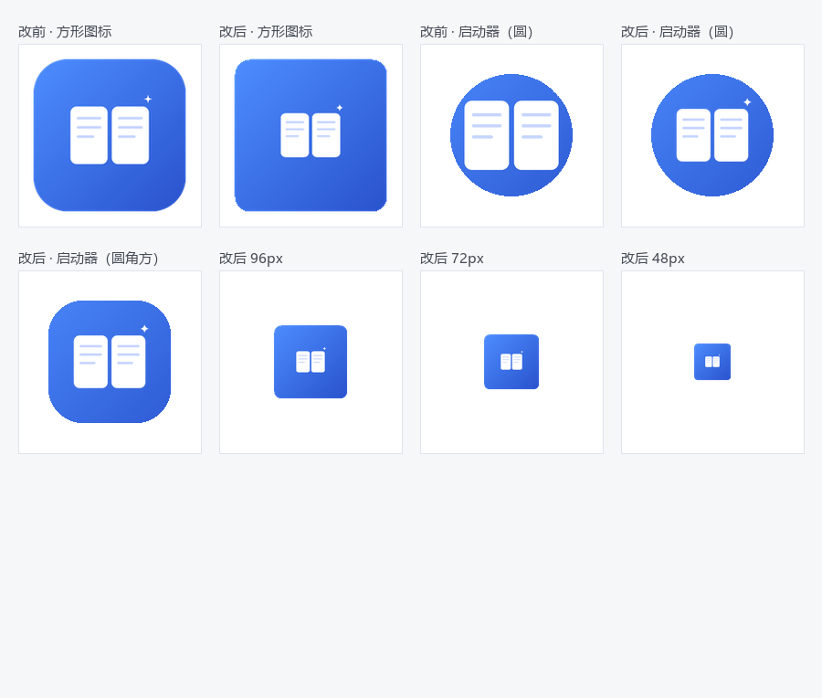

# ShuyoNote Logo

ShuyoNote 的应用标识。设计语言延续「内容优先、克制的色彩」——品牌蓝 `#3370FF` 做焦点，白色图形做主体。

## 设计概念

**「翻开的笔记」** —— 两页摊开的笔记纸，中间留出一道书脊空隙；每页三条正文行呼应「写作 / 记录」。

右上角的**四角星**是一点「灵感火花」，也暗合品牌名首字母 **S** 的笔画走向（Shuyo → S）。

| 元素 | 含义 |
|------|------|
| 两页纸 | 笔记 / 知识 / 书写 |
| 三条正文行 | 记录、排版、块编辑器 |
| 四角星 | 灵感、灵感火花，S 的意象 |
| 品牌蓝渐变 | 焦点与行动（`#4D8DFF → #2952CC`） |

## 文件

| 文件 | 用途 |
|------|------|
| [`shuyonote-mark.svg`](./shuyonote-mark.svg) | **应用图标**（1024×1024，蓝色渐变底 + 白色图形） |
| [`shuyonote-glyph.svg`](./shuyonote-glyph.svg) | **单色图形**（透明底、品牌蓝，用于浅色界面 / favicon / 水印） |
| [`shuyonote-wordmark.svg`](./shuyonote-wordmark.svg) | **横向组合**（图标 + 「ShuyoNote」字标） |
| [`app-icon.png`](./app-icon.png) | **1024×1024 主图**（由 mark 栅格化，作为 `tauri icon` 的输入源） |

## 色彩规格

| 角色 | 色值 |
|------|------|
| 品牌主色 | `#3370FF` |
| 图标渐变（亮） | `#4D8DFF` |
| 图标渐变（深） | `#2952CC` |
| 正文行（图标内） | `#C7D6FF` |
| 字标「Shuyo」 | `#1F2329` |
| 字标「Note」 | `#3370FF` |

> 与设计系统的 `--accent / --accent-strong / --accent-soft` 保持一致（见 `design/design-system.md`）。

## 使用规范

- **最小尺寸**：图标不低于 16px（favicon）或 32px（工具栏）；小于该尺寸时改用 `shuyonote-glyph.svg` 的单色版。
- **留白**：图标四周保留约 10% 的安全边距（squircle 圆角已内建）。
- **背景**：优先使用蓝色渐变底版（`mark`）；在非蓝色背景或浅色界面上使用单色版（`glyph`）。
- **深色模式**：单色 `glyph` 可将图形反白（`#FFFFFF`）使用；渐变底 `mark` 无需调整。
- **不要**：拉伸变形、改变配色、给图形加描边或投影、把四角星移除或放大。

## 生成图标（Tauri）

```bash
# 修改设计后，重新从 mark 导出 1024×1024 主图（覆盖 design/logo/app-icon.png），
# 然后生成全套图标（Windows ICO / macOS ICNS / iOS / Android / PNG 各尺寸）：
pnpm tauri icon design/logo/app-icon.png
```

生成的图标写入 `src-tauri/icons/`。

## Android 图标：单独一套源 ＋ 一条命令（2026-09-21 起）

Android 8 起的自适应图标会被启动器**按它自己的形状裁切**（圆形 / 圆角方 / 水滴），只有中间约
**66–72%** 是安全区 ⇒ 背景该满幅、内容该待在安全区里。原来那份产物是"整枚图标（蓝底＋书）当前景"，
书跟着蓝底一起顶满，裁完显得特别大（owner：「中间的书本太大了，小一点」；现场读数：内容占画布
**53.9%**、可见区内约 **77%**，竖直方向还被裁掉一截）。

所以 Android 单拆了三层源（都在这目录里，改它们而不是改 `app-icon.png`）：

| 文件 | 是什么 |
|------|--------|
| `android-background.svg` | 自适应图标的**背景层**：满幅蓝色渐变 |
| `android-foreground.svg` | 自适应图标的**前景层**：只有两页笔记 ＋ 火花，透明底，整体缩到 **76%** 居中 |
| `android-legacy.svg` | 旧式 `ic_launcher.png`（Android 7 等不吃自适应图标的地方）：蓝底 ＋ 同样 76% 的书 |
| `android-icon.json` | 喂给 `tauri icon` 的 manifest（`default` / `android_bg` / `android_fg`） |

```bash
node scripts/build-android-icons.mjs   # 生成 src-tauri/icons/android/**（先清空再写，21 个文件）
node scripts/android-app-icon.mjs      # 铺进 gen/android 的 res/（gen/ 不入库，每次 init 后都要跑）
```

现在内容占画布 **41%**（可见区内约 **55%**）。**`scale(0.76)` 就是"书多大"的唯一旋钮** ——
想再大/再小，改 `android-foreground.svg` 与 `android-legacy.svg` 里那层 `transform` 的系数再重跑两步。
判据见 `scripts/android-icon-art.test.mjs`（"书不许顶满"读的就是这个系数 ≤ 0.8，且两页仍落在安全区内）。

改前/改后对照板（改前的方形图标与圆形裁切、改后的方形/圆形/圆角方三种 mask、以及 96/72/48px 的实际大小；
合成脚本见提交说明里的 PIL 片段，产物在 `docs/media/android-icon/compare.png`）：



