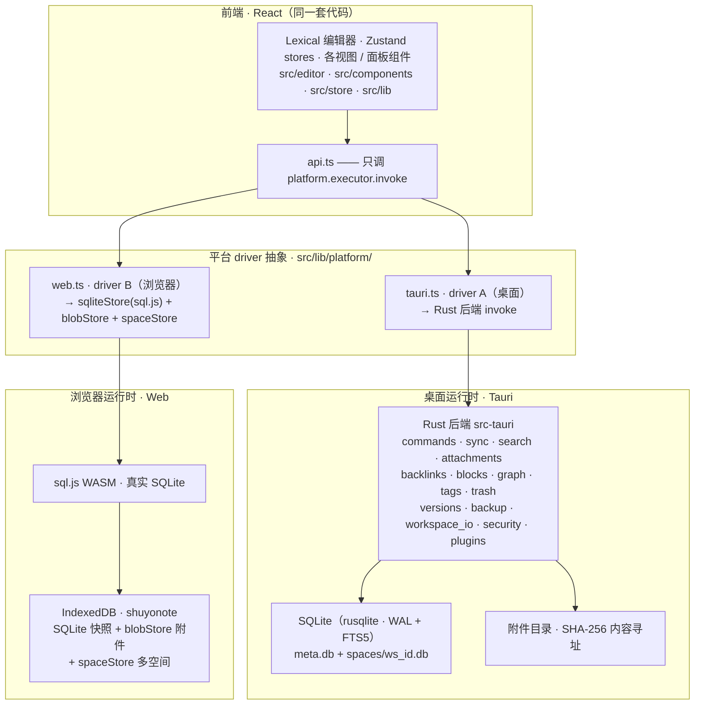

# ShuyoNote 系统架构

> 本文是项目的**架构专文**：从代码实际结构出发，描述前后端分层、平台 driver 抽象、数据与存储模型、关键子系统及其边界。用于帮助新读者快速建立"它怎么搭起来的"的准确认知。
> 关联：[设计哲学](design-philosophy.md)（取舍）/ [跨平台方案](plans/2026-08-24-cross-platform-plan.md)（M16）/ [per-workspace-storage-plan](plans/2026-08-22-per-workspace-storage-plan.md)（存储布局）。现状见 [roadmap.md](roadmap.md)。

---

## 1. 总览：分层与运行时

ShuyoNote 采用 **「平台无关核心 + 可插拔平台壳」** 的架构：同一套前端代码，通过 `src/lib/platform/` 的 driver 抽象，在 **桌面（Tauri + Rust）** 与 **浏览器（Web + sql.js WASM）** 两个平台上运行，业务逻辑与 UI 不感知平台差异。



**核心原则**：`api.ts` 只调用 `platform.executor.invoke`；UI 从不直接接触 SQL / 平台 API。换平台 = 换 driver，不换业务。

---

## 2. 平台 driver 抽象（`src/lib/platform/`）

这是 M16 的关键，也是"桌面/浏览器通吃"的地基。目录只依赖平台类型，不依赖 `@tauri-apps/*`。

| 文件 | 职责 |
|------|------|
| `types.ts` | 定义 `Executor`（invoke）/ `DialogDriver` / `OpenerDriver` / `EventDriver` / `AssetDriver` / `WebviewDriver` 接口，以及聚合的 `Platform`。 |
| `index.ts` | **环境探测 + 聚合**：检测 `window.__TAURI_INTERNALS__` 决定用 `tauriPlatform` 还是 `createWebPlatform()`；导出 `platform` 聚合对象（`setPlatform` 可注入）。 |
| `tauri.ts` | **桌面 driver A**：唯一宿主，封装所有 `@tauri-apps/*`（invoke、dialog、opener、event、asset、webview）。 |
| `web.ts` | **Web driver B**：浏览器实现。约 60 个 invoke 命令（真实 SQL 或安全降级），用 `webPlatform`。 |
| `sqliteStore.ts` | sql.js WASM 封装：`SqliteStore`（run/query/snapshot/restore）+ IndexedDB 持久化 adapter + wasm 加载。 |
| `blobStore.ts` | 附件字节的内容寻址存储（IndexedDB `shuyonote-blobs`，SHA-256 去重）。 |
| `spaceStore.ts` | 多空间 catalog（IndexedDB `shuyonote-spaces`）：工作空间元数据 + 每空间 DB 快照 + active id。 |

> **关键取舍（README 提到）**：`blobStore` 用独立数据库名 `shuyonote-blobs`（不与 `sqliteStore` 的 `shuyonote` / `db` 冲突）；`spaceStore` 用 `shuyonote-spaces` 存多空间快照。

---

## 3. Web 平台的存储模型（driver B）

桌面对每空间一个独立 SQLite 文件；Web 受限于浏览器，用 **快照隔离** 实现等价多空间：

| 存储 | 位置 | 说明 |
|------|------|------|
| SQLite 快照（活动空间） | IndexedDB `shuyonote` / `db` | `SqliteStore` 实时表示**活动**工作空间。 |
| 附件字节 | IndexedDB `shuyonote-blobs` | 内容寻址（hash），跨空间全局去重。 |
| 多空间 catalog | IndexedDB `shuyonote-spaces` | `catalog`（工作空间元数据）、`snapshots`（每空间 DB 快照）、`kv`（active id）。 |

**快照隔离机制**：切换工作空间 = 把当前 live 库 `snapshot()` 存档到 `spaceStore` → 载入目标工作空间快照 → `restore()`。由此实现"每空间物理隔离 + 全局附件去重"，与桌面模型对齐。

---

## 4. 后端（`src-tauri/`，Rust）

Rust 后端是桌面 driver 的业务核心，SQL 收口在 Rust 侧，前端零 SQL。关键模块：

| 模块 | 职责 |
|------|------|
| `db.rs` | SQLite 连接 / 迁移；`meta.db`（应用级）+ `spaces/<id>.db`（每空间）；`reopen_space` 切换活动空间连接。 |
| `commands.rs` | 页面 CRUD（`save_page` 等）。 |
| `search.rs` | FTS5 + trigram 全文检索（含全空间跨库合并）。 |
| `sync.rs` | outbox 变更日志 + LWW + push/pull + 附件同步。 |
| `attachments.rs` | 附件内容寻址存取 / 移动 / 批量删除 / 恢复。 |
| `backlinks.rs` / `blocks.rs` | 块索引、块级引用、块级反链。 |
| `graph.rs` | 关系图数据。 |
| `tags.rs` | 标签 / 看板。 |
| `trash.rs` / `versions.rs` | 回收站 / 版本历史。 |
| `backup.rs` / `workspace_io.rs` | 整库备份 / 单空间导出导入（zip）。 |
| `storage.rs` | 存储统计 / 清理（回收站/孤立附件/版本/临时/软删空间）。 |
| `workspaces.rs` | 工作空间命令 + 跨空间复制。 |
| `templates.rs` / `plugins.rs` | 模板（meta.templates）/ 插件（boa 受限运行时 + 白名单 API）。 |
| `security.rs` / `crypto.rs` | 端到端加密（口令加解密 / 同步门）/ Argon2id + XChaCha20-Poly1305 原语。 |
| `database.rs` / `properties.rs` | 数据库视图 / 查询型 / 公式 / 属性系统。 |
| `windows.rs` | 多窗口。 |
| `models.rs` | 共享数据模型（PageDetail / WorkspaceMeta 等）。 |

**数据模型**：一页 = 一份 Lexical 文档；块映射为 Lexical 根级节点（稳定 `blockId`）；页面层级 = `parent_id` 树；`blocks`/`backlinks` 为「重建即可」的派生索引（不参与同步 outbox）。

---

## 5. 存储布局（物理隔离）

```
<app data dir>/
├── meta.db               # 应用级共享：workspaces / sync_state / templates / plugin_state
├── spaces/
│   └── <ws_id>.db        # 每空间独立 SQLite 库（页面/标签/数据库/版本/附件引用）
└── attachments/          # 全局内容寻址附件（SHA-256 文件名，跨空间去重）
```

- **`meta.db`**：空间清单 + 活动空间 id + 同步配置 + 模板 + 插件状态。
- **每空间库**：该空间全部内容，可单独备份 / 导出 / 加密 / 迁移。
- **附件**：全局内容寻址（hash 文件名），**跨空间去重**；单空间搬移经「空间级附件子集导出」实现（去重 vs 独立搬移的取舍）。

---

## 6. 同步服务端（`shuyonote-sync-server/`，独立二进制）

自建轻量同步服务（Axum + SQLite），与桌面/Web 端通过 HTTP 交互：

- **推送**：客户端 outbox 增量 push；服务端存变更日志 + 附件元数据。
- **拉取**：pull 服务端增量，按页面级 `updated_at` 做 LWW 合并；删除走墓碑。
- **附件**：内容寻址增量；可选端到端加密（push 前加密、pull 后解密，服务端仅存密文）。
- **定时**：客户端启动即同步，之后每 5 分钟周期同步；锁定会话时拒绝同步。

> **仅桌面**：服务端不挂 CORS 层（浏览器发不出跨源请求），且推拉/附件引擎全在 `src-tauri/src/sync.rs`。Web driver 的同步命令是显式降级桩——原因与开启路线见 [Web 同步能力边界](web-sync-boundary.md)。

---

## 7. 数据一致性与安全边界

- **能重建的绝不当作事实源**：`blocks`/`page_fts`/`backlinks`/`db_views` 是派生数据，随页面快照走，不单独同步。
- **IPC 最小暴露面**：前端仅调用语义命令（`save_page`/`search`/`list_pages`），不接触任意 SQL / 任意文件路径。
- **插件安全红线**：受限运行时 + 白名单 API，禁止插件直接进 renderer / 执行任意命令。
- **删除是破坏性操作**：软删（墓碑）+ 导出提醒 + 二次确认；不清空做成普通删除。

---

## 8. 前端目录（`src/`）

| 目录 | 职责 |
|------|------|
| `editor/` | 编辑器 + 自定义节点（Callout/Image/Video/BlockRef/BlockEmbed）+ Markdown 转换 + HTML↔Lexical。 |
| `components/` | 侧边栏 / 页面树 / 搜索 / 看板 / 关系图 / 文件管理 / 各面板。 |
| `store/` | Zustand：notes / theme / space / view / toast / blockCache / treeDrag / treeSelection / 等。 |
| `hooks/` | 自动同步 / 全局快捷键 / Popover。 |
| `plugins/` | 插件命令注册表（命令面板扩展点）。 |
| `lib/` | `api.ts`（invoke 封装）/ `treeReorder.ts`（拖拽重排纯函数）/ `exportMarkdown` / `print` / `tagColor`。 |
| `lib/platform/` | 平台 driver 抽象（见 §2）。 |

> **前端测试**：`scripts/smoke-web.mjs` 用 esbuild 打包 `web.ts` + IDB shim + fs adapter，跑 142 项断言覆盖核心 CRUD/属性/数据库/版本/块引用/备份/多空间/搜索等；同时可单测纯函数（`treeReorder`/`tokenize`）。

---

## 9. 关键技术选型（ADR 摘要）

| 决策 | 理由 | 取舍 |
|------|------|------|
| Tauri 2 而非 Electron | 体积 / 内存小、Rust 后端安全高性能 | 需维护 Rust 层 |
| Lexical 而非 TipTap / ProseMirror | 节点模型契合块编辑、官方 React 绑定 | 较新、生态相对小 |
| 一页一文档，而非每块一编辑器 | 性能与光标正确性；块间引用用自定义节点 | 需自制块 / 引用节点 |
| Rust 封装 SQLite（不用 `tauri-plugin-sql`） | 收口 SQL / 事务 / 迁移；前端零 SQL | 后端职责更多 |
| FTS5 trigram 而非 Meilisearch | 零额外进程、单文件备份；中文任意子串 | 索引略大（量级内可忽略） |
| 附件内容寻址文件系统，而非 BLOB | 大文件不撑爆库、去重、备份友好 | 需维护文件名 / 路径映射 |
| 同步 outbox + 页级 LWW，而非 CRDT | 单用户多设备足够、行为可预测 | 同页并发编辑会覆盖（按需升级） |
| Web 用 sql.js + IndexedDB + 快照隔离（而非 OPFS/wa-sqlite） | 可落地、可验证；多空间快照实现等价隔离 | 需整库快照（量级内可接受） |
| Web 端不实现多设备同步（同步只在桌面） | 引擎在 Rust、浏览器存储模型不匹配、长期凭证放浏览器不安全 | Web 跨设备只能靠备份/导出 zip（详见 [web-sync-boundary.md](web-sync-boundary.md)） |
| **单实例（`tauri-plugin-single-instance`），第二个实例唤起第一个** | 客户端是「本地优先单库」：meta.db 一个 `device_id` / 全局 `token` / `auth_sessions`，多实例会互相覆盖 token、device 绑定冲突（同机不同账号各起实例 = 403） | 一台电脑一个实例；同机多账号同规格要改 per-account device_id，暂不做 |

---

## 10. 常见问题（FAQ）

**Q：桌面和浏览器是同一套数据吗？**
互不透明。二者是**同一前端 × 不同驱动**，存储介质不同（SQLite 文件 vs IndexedDB）。交换靠**备份/导出 zip**（`import_backup`/`export_backup`），格式互认。

**Q：为什么 Web 用快照隔离多空间？**
浏览器无真实文件系统，无法为每空间开一个 SQLite 文件。用「每空间一份 DB 快照 + restore 切换」实现等价隔离，附件字节仍全局内容寻址去重。

**Q：Web 版哪些命令是空实现？**
平台边界类：加密 / 同步 / 插件（浏览器无对应原生能力），web 侧返回安全默认值（降级不崩）；其余核心 CRUD / 属性 / 数据库 / 版本 / 块引用 / 备份 / 搜索均真实 SQL。

**Q：Web 版为什么不能多设备同步？**
四层原因叠加：同步服务端刻意不挂 CORS 层（安全基线）、同步引擎（`do_push`/`do_pull`/`sync_attachments`）整套在 Rust 里、浏览器存储模型（sql.js 整库快照 + IndexedDB blob）与「增量 change_log + 内容寻址附件」协议不匹配、长期团队凭证放浏览器不安全。Web 端跨设备交换走**备份/导出 zip**。完整推理、代码出处与「若要开启」的分阶段路线见 [Web 同步能力边界](web-sync-boundary.md)。

**Q：如何新增一个平台（如鸿蒙 ArkWeb / 安卓）？**
实现 `src/lib/platform/` 接口的新 driver（复用 web.ts 或按平台补 JSBridge），`index.ts` 环境探测切换即可——业务与 UI 不动。
