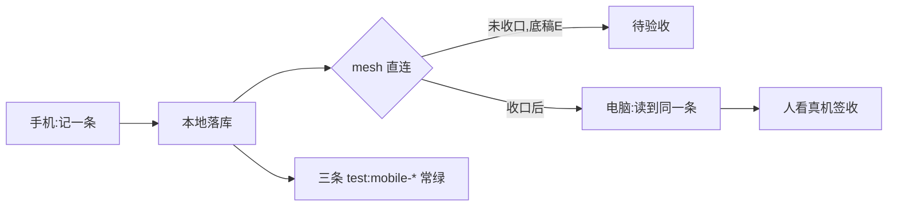

# 移动端需求说明书（2026-10-08）

> **唯一事实来源**：`_tmp/scratch/mobile-facts.md`（2026-10-08 实测，逐字读数，A–G 七节）。
> **状态：规划（待 owner 裁决立项）。** 本文只给依据与范围建议，不替 owner 拍板。
> 数字一律带出处，写成 `读数（底稿 X）`；底稿没给的，标「待量」——不把猜测当事实。

## 1. 一页纸结论

**这个产品线要不要做：待 owner 裁决。** 本文提供依据，不下结论。

支持的读数（做的前提已经变了）：

- Android 壳**已经在用 Tauri**——18 个 android/mobile npm 脚本即证，读数（底稿 B，`package.json` 脚本族）。「Tauri Mobile 是否可行」这个问句已过期。
- 内核**可以切**：12 个零 Tauri 耦合模块，含 `doc_content.rs` 2522 行、`db.rs` 1701 行、`lan.rs` 1290 行、`hlc.rs` 710 行，读数（底稿 A，`grep -ro "tauri::" src-tauri/src/*.rs | wc -l`）。
- 三条移动端回归门禁**已存在**：`test:mobile-layout` / `test:mobile-views` / `test:mobile-overlays`，读数（底稿 B）。

扣分项（不能假装没有）：

- **设备直连一轮都没成功搬过数据**，读数（底稿 E）。三个旁证：`mesh_cursor:*` 0 条（全表 89 键）；`sync_profiles` 两行的 `last_pushed_seq` ＝ `last_pulled_seq` ＝ 0；`mesh_paired_devices` 0 行。`mesh_pair_secret:<room>:<self>` 值长 **0**（空值），读数（底稿 E）。
- 需求侧**没有任何真实数据**：目前没有客户请求 / 评论数据 / 使用数据，底稿自己承认「属场景推演」，读数（底稿 G）。
- 产能有限：owner 同期纪录片 **2026-10-10 开机**，约**每周 3.5 天**，读数（底稿 G）。

**先做到哪一步：最小可验收切片 ＝「手机上记一条 ＋ 同步到电脑」**，读数（底稿 G）。其中「同步到电脑」依赖上面那个未收口的 mesh，通道口径（局域网直连 / 先落本地再等收口）**待 owner 裁决**。

**开工前必须收口的一件**：mesh 直连（底稿 E）。它是移动端同步的**前置**，不是移动端的活。

## 2. 用户与场景

四类场景。除场景 1 外，其余三类**无数据支撑，属场景推演**（读数（底稿 G）：没有客户请求 / 评论 / 使用数据）。每类的「多久」底稿**未给读数 ⇒ 待量**。

| 场景 | 谁 | 在哪 | 多久 | 要完成什么 | 依据 |
|---|---|---|---|---|---|
| 1. 拍摄现场碎片捕捉 | owner 本人 | 拍摄现场 | 待量 | 把一条观察 / 一个待办记进手机，回到电脑能读到 | 读数（底稿 G：owner 同期在拍摄，约每周 3.5 天） |
| 2. 通勤查阅 | owner 本人 | 通勤路上 | 待量 | 翻看已有笔记，只读不改 | 场景推演（底稿 G 无使用数据） |
| 3. 阅读时查词 | owner 本人 | 阅读场景 | 待量 | 查一个词，不跳出笔记上下文 | 场景推演（底稿 G 无使用数据） |
| 4. 待办勾选 | owner 本人 | 任意 | 待量 | 勾掉手机上一条待办，电脑侧一致 | 场景推演（底稿 G 无使用数据） |

场景 1 与最小切片同源，是四类里**唯一有 owner 侧证据**的一类。

## 3. 需求清单（P0 / P1 / P2）

### P0 —— 必须有，缺了不成立

| 编号 | 一句话需求 | 验收口径（可测：看到什么算做到） | 依据 |
|---|---|---|---|
| M-P0-1 | 手机上记一条 | 新建 1 页 → 输入文字 → 退出重进，内容还在；该页 `content_json` 读出 ≥ 1 个块 | 读数（底稿 G：最小切片）；数据形态见底稿 D |
| M-P0-2 | 这条同步到电脑 | 电脑侧读到**同一页面**、块数与文本一致 | 读数（底稿 G：最小切片）；⚠️ 通道依赖底稿 E 的 mesh，**通道口径待 owner 裁决** |
| M-P0-3 | 离线可记 | 飞行模式下新建 ＋ 编辑 ＋ 重进，内容不丢；恢复网络后不做「外部写入被写回旧版本」 | 底稿 D 教训 1（写 19 块 ⇒ 回读 3 块；写 18 块 ⇒ 回读 3 块，两次实测） |
| M-P0-4 | 三条回归门禁常绿 | `test:mobile-layout` / `test:mobile-views` / `test:mobile-overlays` 三条均退出码 0 | 读数（底稿 B、F） |
| M-P0-5 | 真机验收有人签收 | 人在真机上看截图 / 手感并签收（机器读数**不替代**） | 读数（底稿 F：真机验收只能由人看） |
| M-P0-6 | 写入走应用授权通道并留审计 | 写入后 `plugin-audit.jsonl` 有对应记录；无「改数据库 / 改配置 / 绕令牌」的改动 | 读数（底稿 C：每次调用写审计；底稿 F：不改数据库/配置/令牌绕应用通道） |

### P1 —— 有了明显更好

| 编号 | 一句话需求 | 验收口径 | 依据 |
|---|---|---|---|
| M-P1-1 | 写操作先给用户看、确认才落库（草稿档） | 触发一次写能力，用户看到草稿；不确认 ⇒ 库里无该写入 | 读数（底稿 C：写能力 9 条，其中 6 条走草稿） |
| M-P1-2 | 竖屏锁定 ＋ 壳校验脚本接入 | `android:portrait-lock` / `check:android-portrait-lock` 通过 | 读数（底稿 B：脚本族） |
| M-P1-3 | 应用身份件校验（包名 / 图标 / 启动图） | `check:android-app-name` / `check:android-app-icon` / `check:android-splash-theme` 通过 | 读数（底稿 B：脚本族） |
| M-P1-4 | 后台写入不覆盖编辑器内容 | 同一页**在编辑器里开着**时，外部多次写入后回读块数**不减少** | 底稿 D 教训 1（19⇒3、18⇒3 两个反例；一次性写完的页 6 分钟守恒） |
| M-P1-5 | 只读查阅模式 | 场景 2 下能翻页、能搜索（形态**待量**），且不产生写审计记录 | 场景推演；底稿 C 四档开关含「只读」档 |

### P2 —— 以后再说

| 编号 | 一句话需求 | 验收口径 | 依据 |
|---|---|---|---|
| M-P2-1 | 阅读时查词 | 查词结果就地出现，笔记不丢焦点 | 场景推演（无数据） |
| M-P2-2 | 待办勾选跨端一致 | 手机上勾选后，电脑侧同一待办为已完成 | 场景推演（无数据） |
| M-P2-3 | iOS 真机构建 | `src-tauri/gen/apple` 工程可在真机装上并跑通 M-P0-1 | 读数（底稿 B：Apple/iOS 工程已存在） |
| M-P2-4 | 内核切片按零耦合模块抽出复用 | 抽出的 crate 不依赖 `tauri::`（当前全仓 435 处耦合） | 读数（底稿 A：零耦合模块清单；435 处 `tauri::`） |

⛔ **移动端不做「与 Tauri 解耦」这件事的全量版**：全仓 435 处 `tauri::`（底稿 A）＝ 远超最小切片。切片只在 `doc_content.rs` / `db.rs` / `hlc.rs` 这类零耦合模块上做（底稿 A）。

## 4. 不做清单（及理由）

| 不做 | 理由 |
|---|---|
| 全功能块编辑器移植 | 最小切片只需「记一条」（底稿 G）；能力面 26 条（底稿 C），全搬与切片无关。**口径：引擎保留、协作 UI 不做。** |
| 属性数据库编辑 | 底稿 C 的 26 条能力里没有为移动端设计的属性编辑面；形态**待量**。 |
| Ontology 图谱 | 同上，底稿 C 未列；与最小切片无关（底稿 G）。 |
| 视频生产流水线 | 与「记一条 ＋ 同步」无关（底稿 G）；owner 拍摄期产能约每周 3.5 天（底稿 G），不挪给无关面。 |
| 插件管理 | MCP 宿主面只绑回环（127.0.0.1）并认令牌（底稿 C），手机上「让外部 AI 写进手机笔记」**尚未设计、属待拍板**（底稿 C）。**口径：引擎保留、协作 UI 不做。** |
| 全库索引重建 | 与最小切片无关（底稿 G）；且块口径有陷阱——同一页 `content_json` 20 块而 `blocks` 表 0 行、MCP `blocks_list` 返回 `[]`（底稿 D 教训 2）。 |
| MCP 配置 | 令牌 / 授权在移动端怎么摆**尚无设计**（底稿 C 原文）⇒ 待拍板；写入必须走应用授权通道并留审计（底稿 F）。 |

## 5. 非功能需求

| 项 | 要求 | 口径 / 依据 |
|---|---|---|
| 离线可用 | P0 全功能在无网下成立 | M-P0-3；写路径不得依赖网络 |
| 同步一致性 | ⚠️ **如实记**：设备直连**一轮都没成功搬过数据**（底稿 E）。所以 P0 的同步**不许假设它已可用**；一致性判据建立在「一遍搬运成功后：两侧页面与块数一致」之上 | 读数（底稿 E）：`mesh_cursor:*` 0 / 89 键；`sync_profiles` 2 行 seq 全 0；`mesh_pair_secret` 值长 0；`mesh_paired_devices` 0 行 |
| 耗电与后台同步 | 后台同步的耗电上限、唤醒频率 ⇒ **待量**；量法：真机同场景对比开 / 关后台同步的耗电 | 底稿未给读数 ⇒ 待量（不许编数） |
| 隐私与合规 | ① App Store 审核 ② 安卓备案 / 软著 ③ 个人信息保护法。所需材料清单与时长 ⇒ **待量** | 底稿未给读数 ⇒ 待量；纪律见底稿 F（不改数据库/配置/令牌绕应用通道，写入留审计） |
| 安装包体积 | 体积上限 ⇒ **待量**；量法用现成脚本 `check:android-bundle`（另有 `android:stage-pdfium`） | 读数（底稿 B：脚本族）；阈值待量 |
| 平台前提 | 无 WASM / 无 C ABI / 无 JNI / 无 FFI 目标；桥接只有 Tauri IPC | 读数（底稿 A：`wasm` / `no_mangle` / `extern "C"` / `cbindgen` / `uniffi` 全零命中；桌面桥接＝Tauri IPC） |

## 6. 验收与回归

**机器侧（必须常绿）**

1. 三条移动端门禁：`test:mobile-layout` / `test:mobile-views` / `test:mobile-overlays`，读数（底稿 B、F）。
2. 提交前全绿：`node scripts/test-report.mjs`（**60 条**）＋ `npx tsc --noEmit`，读数（底稿 F）。
3. 三条 `test:mobile-*` 任一红 ⇒ 该次提交不成立（底稿 F）。

**人侧（机器读数不替代）**

4. 真机验收**只能由人看**（截图 / 手感），读数（底稿 F）。
5. 人签收项：M-P0-1 记一条、M-P0-2 电脑侧读到、M-P0-3 飞行模式不丢。

**红线**

6. 不改数据库 / 配置，不用令牌绕过应用通道；一切写入走应用授权通道并留审计，读数（底稿 F、C）。

**未收口项（必须在验收里点名）**

7. 设备直连一轮都没成功搬过数据（底稿 E）。**它是 M-P0-2 的前置**：未收口前，M-P0-2 只能算「待验收」，不能算「已通过」。

## 7. 范围建议

- **最小可验收切片 ＝ 手机上记一条 ＋ 同步到电脑**，读数（底稿 G）。
- 顺序：先 P0 六条；P0 里 M-P0-2 卡在 mesh（底稿 E）⇒ 建议先把 mesh 收口，或把切片分成「记一条（可验收）」与「同步（待 mesh）」两段，**怎么切待 owner 裁决**。
- P1 在 P0 全绿后进；P2 不进本轮。
- 不做清单（§4）本轮不动。

## 8. 待量清单（汇总，避免漏项）

| 待量项 | 量法 |
|---|---|
| 四类场景的「多久」 | owner 自述或使用数据（当前无数据，底稿 G） |
| 后台同步耗电上限 | 真机同场景开 / 关对比 |
| 安装包体积阈值 | `check:android-bundle` 读数后定阈值（底稿 B） |
| App Store / 备案 / 软著的材料与时长 | 平台与主管部门口径，底稿未给 |
| 移动端写能力的令牌与授权摆放 | 尚无设计（底稿 C）⇒ 待拍板 |
| 同步通道口径（直连 / 先本地后收口） | 待 owner 裁决；前置是 mesh 收口（底稿 E） |
