# 移动端说明书（2026-10-08）

状态：已拍板（立项＝做；owner 2026-10-09 拍「做成产品线」）—— **施工中**：§4 已有 3 屏落地（01 首页／02 快速记录／09 启动页），其余仍未接线 ✗

> 证据：`mobile/STATUS-2026-10-10.html`（即 docs/plans/mobile/STATUS-2026-10-10.html，§④「立项口径」逐字「移动端立项＝**做** ✓」）· `../../src/components/MobileHome.tsx` · `../../src/components/MobileCapture.tsx` · `../../index.html`

> **这份文档是自足的。** 三份既有交付物 —— 需求说明书 / 高保真效果图 / 详细技术方案 —— 在这里合并成一篇；
> 只看这一篇，就能回答「做什么 / 长什么样 / 怎么做 / 做到什么算成 / 还有什么待拍板」。
> **事实来源**：`_tmp/scratch/mobile-facts.md`（2026-10-08 实测逐字读数，A–G 七节，**唯一事实来源**）。
> 本文每个数字都写成 `读数（来源）`；底稿没给的一律写「**待量**」，⛔ 不编，也不拿「通常/应该/大概」当事实。
> **本文不替 owner 拍板**：需要 owner 决定的事项集中在 §11，每条都写「沉默 ⇒ 取零风险默认」。
>
> 被合并的三份底稿（原文仍在，本文不替代它们的历史价值）：
> [`2026-10-08-mobile-requirements.md`](./2026-10-08-mobile-requirements.md)（144 行，需求）、
> [`2026-10-08-mobile-tech-plan.md`](./2026-10-08-mobile-tech-plan.md)（423 行，技术方案）、
> [`mockups/README.md`](./mockups/README.md)（10 屏 SVG 索引与 token 对照）。
>
> ⛔ **四个曾经写错、本文不许再犯的结论**（逐条反着写，先摆在最前面）：
> ① **不把 WASM 当成现成可复用的前提** —— **没有 WASM 目标**（读数：底稿 A，全仓 `wasm` 零命中）。
> ② **不把移动端可行性当成悬而未决的问题** —— **现有 Android 壳已经在用 Tauri**（读数：底稿 B，18 个 android/mobile npm 脚本即证）。
> ③ **不把写路径说成「先审后落库」的唯一一条** —— 写能力 9 条里**只有 6 条走草稿**，另 **3 条直接落库**（读数：底稿 C）。
> ④ **不把 435 处耦合都算到那 6 个文件头上** —— **45 个文件非零**，最密的 6 个只占 **222（51%）**，其余 **213（49%）散在另外 39 个文件**（读数：底稿 A ＋ 2026-10-08 复算）。

---

### 4.9 启动页（Splash）

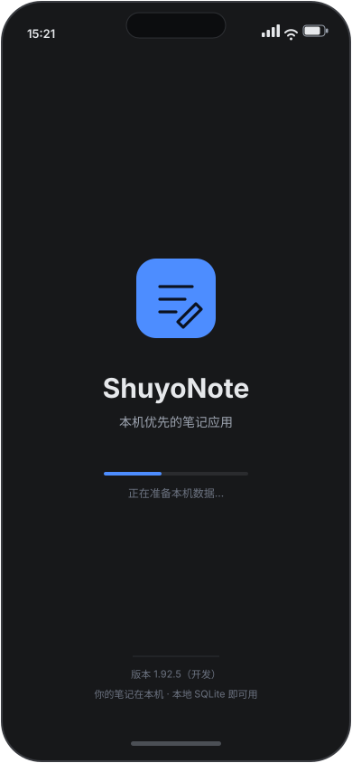

- **状态：已实现** ✓（2026-10-10）。依据：提交 `d5757a61` —— 只改 `index.html` **一个文件**，
  把开屏做成**静态层**（内联 `<style>` ＋ `#app-splash`）；消失复用**既有** `src/main.tsx` 的 `hideSplash()`，未改 `src/**`。
  ⚠️ **两处与本节下面的旧读数不一致，以本条为准**：① 实现里的版本号是 **1.92.6**（本节原写「1.92.5（开发）」**已过期** ✗）；
  ② 副标「本机优先的笔记应用」的出处是**本效果图**（`09-splash.svg:34`），**不是** `README.md` 徽章行
  （读数：`grep -n "本机优先的笔记应用" README.md` ⇒ **零命中** ✗）。

- 给谁用：**所有人**，每次冷启动的第一眼（首启体验）。
- 相关需求：**非功能／首启体验**；与 **M-P1-3**（应用身份件：启动图 `android:splash-theme` ⇄ `check:android:splash-theme`）相关。
- 视觉（owner 已选定）：**发光的字标** —— 双层径向光晕把视线吸到产品名上；加载指示是一条细进度条（流动高光段 ＋ 笔尖光点）。
- 关键交互：**没有交互** —— 只显示产品标记、一句副标题、一条加载指示与「正在准备本机数据…」；数据就绪后自动进入首页。
- 与桌面端的差别：桌面端没有这一步（窗口即界面）；移动端需要它盖住冷启动加载期。
- 文案依据（2026-10-10 修正）：副标题「本机优先的笔记应用」与「你的笔记在本机 · 本地 SQLite 即可用」**逐字取自本效果图**（`09-splash.svg:34`／`:42`）；版本号那一格图上写「1.92.5（开发）」**已过期** ✗ ⇒ 实现写的是 `package.json` 的现值 **1.92.6**。⚠️ 它在 `index.html` 里是**字面量**：CSP 的 `script-src` 不含 `'unsafe-inline'` ⇒ 开屏不能内联脚本去自动取版本，`package.json` 的 `dev`／`build` 也不生成可读的版本文件 ⇒ **发版时会漂** ✗，根治要动 `vite.config.ts` 加构建期注入。

### 4.10 关于页

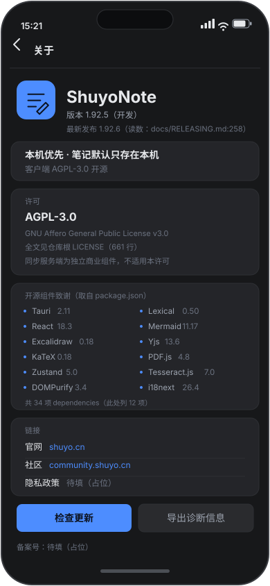

- **状态：仍未实现** ✗（2026-10-10）；⚠️ 本节下面的「版本 **1.92.5**」**已过期** ✗ ⇒ 现值 **1.92.6**
  （读数：`python3 -c "import json;print(json.load(open('package.json'))['version'])"` ⇒ `1.92.6`）。

- 给谁用：想知道「这是什么、什么许可、用了谁的东西、有没有更新」的人（含合规视角）。
- 相关需求：**M-P0-6**（审计与透明：许可与组件来源可核）＋ 非功能合规（隐私/备案占位）。
- 关键交互：「检查更新」发起更新检查；「导出诊断信息」导出本地诊断；链接区按 owner 要求**只显示「官网 `shuyo.cn`」与「社区 `community.shuyo.cn`」两行**（⛔ **不显示源码网址** ✗），**隐私政策与备案号为占位**（⛔ 没有编造 URL ✓）。
- 与桌面端的差别：与桌面端同一份信息，但**只读展示**、不提供高级配置入口。
- 依据（逐条可核）：许可 **AGPL-3.0**（`LICENSE:1-2`「GNU AFFERO GENERAL PUBLIC LICENSE / Version 3」；`README.md:465` 同述；⚠️ 同步服务端为独立商业组件、不适用本许可 —— `README.md:471`）；开源组件 **12 项**，名字与版本取自 `package.json` 的 `dependencies`（共 34 项），⚠️ **未逐个核过它们的许可证**，故只写名字与版本；版本 **1.92.6**（`package.json.version`，2026-10-10 复量）、最新发布 **1.92.6**（`docs/RELEASING.md:258`）；链接 官网 `shuyo.cn/app`（`README.md:32`）、社区 `community.shuyo.cn`（`README.md:36`）。

## 1. 一句话结论

**要不要立项：已拍板 —— 做** ✓（owner 2026-10-09 拍「做成产品线」，读数：[`STATUS-2026-10-10.html`](./STATUS-2026-10-10.html) §④）。
本文给依据、给范围、给做法；⛔ 仍然**不把「未收口」写成「已完成」**。

一句话是可做的最小切片：**「手机上记一条 ＋ 同步到电脑」**，读数（底稿 G）。
其中「记一条」今天就能做；「同步到电脑」依赖一个**尚未收口**的设备直连（§6.2、§7.3）——
**它是前置依赖，不是移动端的活**。

支持立项的读数（前提已经变了）：

- **Android 壳已经在用 Tauri**：18 个 android/mobile npm 脚本即证，读数（底稿 B，`package.json` 脚本族）。
  ⇒ 「Tauri Mobile 是否可行」这个问句**已经过期**。
- **内核可以切**：12 个零 Tauri 耦合模块，含 `doc_content.rs` 2522 行 / `db.rs` 1701 行 / `lan.rs` 1290 行 / `hlc.rs` 710 行，读数（底稿 A）。
- **三条移动端回归门禁已经存在**：`test:mobile-layout` / `test:mobile-views` / `test:mobile-overlays`，读数（底稿 B）。

扣分项（不能假装没有）：

- **设备直连一轮都没成功搬过数据**，读数（底稿 E）。三个旁证见 §6.2。
- **需求侧没有任何真实数据**：没有客户请求 / 评论数据 / 使用数据，底稿自己承认「属场景推演」，读数（底稿 G）。
- **产能有限**：owner 同期纪录片 **2026-10-10 开机**，约**每周 3.5 天**，读数（底稿 G）。

状态行（2026-10-10 更新）：**已拍板（立项＝做）**，施工中 —— 已落地的三屏见 §4.1／§4.2／§4.9。
⛔ 本文不把「未收口」写成「已完成」。（原文写「规划（立项待 owner 裁决）」**已过期** ✗：owner 2026-10-09 已拍「做成产品线」。）

---

## 2. 用户与场景

四类场景。除场景 1 外，其余三类**无数据支撑，属场景推演**（读数：底稿 G，没有客户请求 / 评论 / 使用数据）。
每类的「多久」底稿**未给读数 ⇒ 待量**。

| 场景 | 谁 | 在哪 | 多久 | 要完成什么 | 依据 |
|---|---|---|---|---|---|
| 1. 拍摄现场碎片捕捉 | owner 本人 | 拍摄现场 | 待量 | 把一条观察 / 一个待办记进手机，回到电脑能读到 | 读数（底稿 G：owner 同期在拍摄，约每周 3.5 天） |
| 2. 通勤查阅 | owner 本人 | 通勤路上 | 待量 | 翻看已有笔记，只读不改 | 场景推演（底稿 G 无使用数据） |
| 3. 阅读时查词 | owner 本人 | 阅读场景 | 待量 | 查一个词，不跳出笔记上下文 | 场景推演（底稿 G 无使用数据） |
| 4. 待办勾选 | owner 本人 | 任意 | 待量 | 勾掉手机上一条待办，电脑侧一致 | 场景推演（底稿 G 无使用数据） |

场景 1 与最小切片同源，是四类里**唯一有 owner 侧证据**的一类。

**这四类场景怎么落到界面**：场景 1 → §4 的 01/02 屏；场景 2 → 03/04 屏；场景 3 → 04/06 屏；场景 4 → 05 屏。
`07-settings` 与 `08-pair` 是支撑屏（授权入口与跨端通道），不单独对应某类场景。

---

## 3. 需求清单（P0 / P1 / P2）

P0 六条 / P1 五条 / P2 四条，读数（本文统计自需求说明书原文表格）。
每条都带**可测验收口径**（看到什么算做到）与**依据**两列 —— 保留这两列，是为了让验收不靠印象。

### 3.1 P0 —— 必须有，缺了不成立

| 编号 | 一句话需求 | 验收口径（可测：看到什么算做到） | 依据 |
|---|---|---|---|
| M-P0-1 | 手机上记一条 | 新建 1 页 → 输入文字 → 退出重进，内容还在；该页 `content_json` 读出 ≥ 1 个块 | 读数（底稿 G：最小切片）；数据形态见底稿 D |
| M-P0-2 | 这条同步到电脑 | 电脑侧读到**同一页面**、块数与文本一致 | 读数（底稿 G：最小切片）；⚠️ 通道依赖底稿 E 的 mesh，**通道口径待 owner 裁决**（§11） |
| M-P0-3 | 离线可记 | 飞行模式下新建 ＋ 编辑 ＋ 重进，内容不丢；恢复网络后不做「外部写入被写回旧版本」 | 底稿 D 教训 1（写 19 块 ⇒ 回读 3 块；写 18 块 ⇒ 回读 3 块，两次实测） |
| M-P0-4 | 三条回归门禁常绿 | `test:mobile-layout` / `test:mobile-views` / `test:mobile-overlays` 三条均退出码 0 | 读数（底稿 B、F） |
| M-P0-5 | 真机验收有人签收 | 人在真机上看截图 / 手感并签收（机器读数**不替代**） | 读数（底稿 F：真机验收只能由人看） |
| M-P0-6 | 写入走应用授权通道并留审计 | 写入后 `plugin-audit.jsonl` 有对应记录；无「改数据库 / 改配置 / 绕令牌」的改动 | 读数（底稿 C：每次调用写审计；底稿 F：不改数据库/配置/令牌绕应用通道） |

### 3.2 P1 —— 有了明显更好

| 编号 | 一句话需求 | 验收口径 | 依据 |
|---|---|---|---|
| M-P1-1 | 写操作先给用户看、确认才落库（草稿档） | 触发一次写能力，用户看到草稿；不确认 ⇒ 库里无该写入 | 读数（底稿 C：写能力 9 条，其中 6 条走草稿） |
| M-P1-2 | 竖屏锁定 ＋ 壳校验脚本接入 | `android:portrait-lock` / `check:android-portrait-lock` 通过 | 读数（底稿 B：脚本族） |
| M-P1-3 | 应用身份件校验（包名 / 图标 / 启动图） | `check:android-app-name` / `check:android-app-icon` / `check:android-splash-theme` 通过 | 读数（底稿 B：脚本族） |
| M-P1-4 | 后台写入不覆盖编辑器内容 | 同一页**在编辑器里开着**时，外部多次写入后回读块数**不减少** | 底稿 D 教训 1（19⇒3、18⇒3 两个反例；一次性写完的页 6 分钟守恒） |
| M-P1-5 | 只读查阅模式 | 场景 2 下能翻页、能搜索（形态**待量**），且不产生写审计记录 | 场景推演；底稿 C 四档开关含「只读」档 |

### 3.3 P2 —— 以后再说

| 编号 | 一句话需求 | 验收口径 | 依据 |
|---|---|---|---|
| M-P2-1 | 阅读时查词 | 查词结果就地出现，笔记不丢焦点 | 场景推演（无数据） |
| M-P2-2 | 待办勾选跨端一致 | 手机上勾选后，电脑侧同一待办为已完成 | 场景推演（无数据） |
| M-P2-3 | iOS 真机构建 | `src-tauri/gen/apple` 工程可在真机装上并跑通 M-P0-1 | 读数（底稿 B：Apple/iOS 工程已存在） |
| M-P2-4 | 内核切片按零耦合模块抽出复用 | 抽出的 crate 不依赖 `tauri::`（当前全仓 435 处耦合） | 读数（底稿 A：零耦合模块清单；435 处 `tauri::`） |

⛔ **移动端不做「与 Tauri 解耦」的全量版**：全仓 **435** 处 `tauri::`（读数：底稿 A）＝ 远超最小切片。
切片只在 `doc_content.rs` / `db.rs` / `hlc.rs` 这类**零耦合模块**上做（读数：底稿 A）。

---

## 4. 界面与效果图（10 屏逐屏）

**10 屏全部嵌在下面**，路径都是相对本文件的 `./mockups/0X-xxx.svg`，**10** 个文件均在
[`mockups/`](./mockups/README.md) 目录内，读数（2026-10-10 复量：`ls docs/plans/mobile/mockups/*.svg | wc -l` ⇒ **10**；
⚠️ 此处原写「共 8 个」**是错的** ✗ —— 与本文 §4.1–§4.10 十节、与磁盘上的 10 个文件都不符）。

**设计口径（10 屏共用）**：画布 390×844；配色 / 字号 / 圆角**一律取本产品自己的**
[`design-system.md`](../../../design/design-system.md) **深色列 token**，读数（[`mockups/README.md`](./mockups/README.md) §4）：
`--bg #17181A`、`--surface #242529`、`--text #E6E8EB`、`--accent #4D8DFF`；
分类色 红 `#F54A45` / 橙 `#FF8A1E` / 绿 `#00B578`。⛔ 未自创品牌色、未新增主题。
**状态（2026-10-10）**：⛔ **不再用一句「未接线，界面尚未实现」概括** —— 逐屏看：
**已落地 3 屏** ✓（**01 首页** §4.1 · **02 快速记录** §4.2 · **09 启动页** §4.9）；
**仍未实现 7 屏** ✗（03／04／05／06／08／10 六屏 ＋ **07 设置**：组件已在仓里但**未接线**，owner 拍「先不接」）。
每屏的状态与依据写在各自小节的开头 ✓。效果图 ≠ 功能已做，读数（[`mockups/README.md`](./mockups/README.md) §6）。

### 4.1 `01-home.svg` —— 首页 · 三个入口

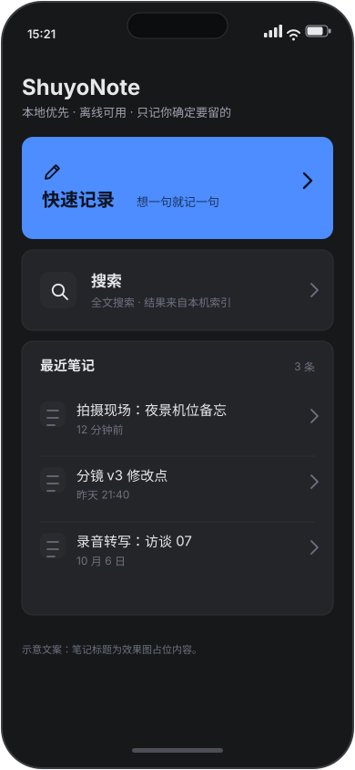

- **状态：已实现** ✓（2026-10-10）。依据：提交 `de50d59e`（`git show --stat` ⇒ 新增 `src/components/MobileHome.tsx` ＋ `src/App.tsx` 7 行 ＋ `src/App.css` 136 行）—— 接进 `App.tsx` 的 `isMobile` 分支（桌面那一支未动）；三入口文案 `快速记录`／`搜索`／`最近笔记` 与「⛔ 无页面树、无侧边栏」在实现里逐字核过 ✓（台账 R186 记有模拟器实拍截图）。

- **给谁用**：owner 本人，拍摄现场单手打开 App 的第一屏（场景 1）。
- **解决哪条需求**：**M-P0-1**（记一条的入口）、**M-P0-3**（离线可记：无网时三个入口全部可用）。
- **关键交互**：点「快速记录」（`--accent` 主行动）→ 02 屏；点「搜索」→ 03 屏；点最近笔记 → 04 屏。
- **存哪里**：本屏不写库；笔记只在本机（不登录、不上传）—— 因为同步通道尚未打通（§6.2）。
- **与桌面端的差别**：桌面有页面树与侧边栏；本屏**只有三个入口**，⛔ 无页面树、无侧边栏。

### 4.2 `02-capture.svg` —— 快速记录（键盘上方的快捷工具栏）

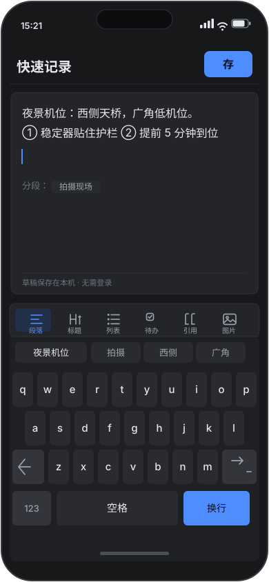

- **状态：已实现** ✓（2026-10-10）。依据：提交 `e5c5c295`（`git show --stat` ⇒ 新增 `src/components/MobileCapture.tsx` ＋ `src/store/mobileNav.ts`，并改 `MobileHome.tsx`／`App.tsx`／`App.css`）；
  六项工具栏（段落 / 标题 / 列表 / 待办 / 引用 / 图片）与「草稿保存在本机 · 无需登录」在实现里逐字核过 ✓。
  同一提交修掉**两个真缺陷** ✗→✓：① 该屏按安卓返回键**直接退出应用** ✗（改走既有返回栈）；② 左下全局汉堡键**压住「段落」** ✗（工具栏让位）。

- **给谁用**：场景 1 的 owner，站着、单手、几十秒内记完一句。
- **解决哪条需求**：**M-P0-1**（记一条）、**M-P0-3**（离线可记）。
- **关键交互**：输入区输入文字 → 键盘上方的快捷工具栏（段落 / 标题 / 列表 / 待办 / 引用 / 图片 6 项）→ 主按钮「存」。
- **存哪里**：草稿态写明「保存在本机 · 无需登录」；落库形态是 `content_json`（JSON 文本），读数（底稿 D）。
- **与桌面端的差别**：桌面是块编辑器全功能；本屏只做「记一条」，工具栏收成 6 项。
- ⚠️ 技术约束：写入必须**一次调用写完**（教训 1，§7.4），⛔ 不许拆多次。

### 4.3 `03-search.svg` —— 搜索（命中片段高亮）

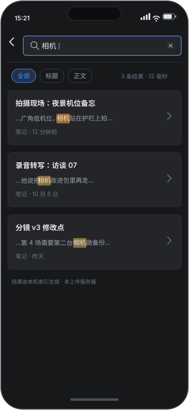

- **状态：仍未实现** ✗（2026-10-10）：仓里没有对应屏；首页那个「搜索」入口现在走的是**既有命令面板**
  （`de50d59e` 的提交信息里如实标注为「**03 屏待做**」✗）。

- **给谁用**：场景 2 的 owner，通勤路上翻已有笔记。
- **解决哪条需求**：**M-P1-5**（只读查阅；形态**待量**，本图给出一种形态）。
- **关键交互**：搜索框输入关键词 → 顶部筛选（全部 / 标题 / 正文）→ 结果列表逐条带命中片段高亮，
  **当前命中与其他命中两档底色**（`--highlight-active-bg` vs `--highlight-bg`）。
- **存哪里**：本屏**不写库**；「只读」档不产生写审计记录，读数（底稿 C 四档开关含「只读」）。
- **与桌面端的差别**：桌面是完整检索面；移动端只有「框 ＋ 列表 ＋ 筛选」这一种形态，且**形态待量**。

### 4.4 `04-read.svg` —— 阅读（正文排版 ＋ 在电脑上继续）

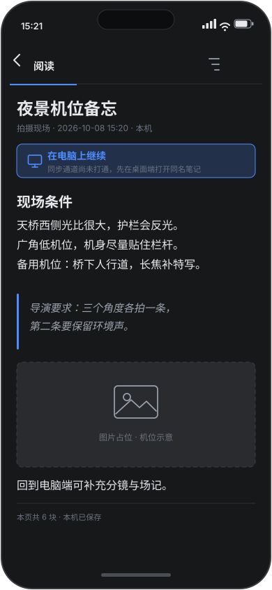

- **状态：仍未实现** ✗（2026-10-10）：本轮四屏（owner 2026-10-10 拍「最小几屏」＝首页／记一条／设置／启动页）不含它。
  ⚠️ **时刻读数**：2026-10-10 09:5x 的工作树里已出现一份**未入库**的 `src/components/MobileRead.tsx`（`git status` ⇒ `??`）
  ⇒ 有人正在做这一屏 ⇒ **本行的"仍未实现"以入库（提交）为准** ✓，落地后请连同本条一起改。

- **给谁用**：场景 2（通勤查阅）与场景 3（阅读时查词）的 owner。
- **解决哪条需求**：**M-P1-5**（只读查阅），并画出 **M-P0-2 的未收口边界**。
- **关键交互**：顶部返回 ＋「在电脑上继续」；正文含标题 / 段落 / 引用 / 图片占位。
- **存哪里**：只读；页面数据来自本机（页脚标注「本页共 6 块 · 本机已保存」）。
- **与桌面端的差别**：本屏**如实标注「同步通道尚未打通」**（读数：底稿 E），桌面端无此提示 —— 桌面本来就是本机正本。

### 4.5 `05-todo.svg` —— 待办勾选

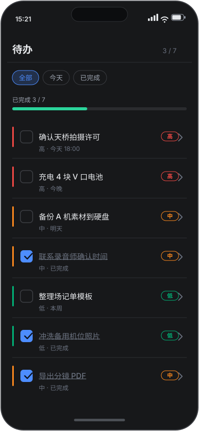

- **状态：仍未实现** ✗（2026-10-10）。

- **给谁用**：场景 4 的 owner，任意地点勾掉一条待办。
- **解决哪条需求**：**M-P2-2**（跨端一致**待 mesh**）。
- **关键交互**：点勾选框；已完成态＝勾选 ＋ 删除线；三档优先级色标 高=红 `#F54A45` / 中=橙 `#FF8A1E` / 低=绿 `#00B578`，
  并**另带「高/中/低」文字**，不只靠颜色。
- **存哪里**：勾选落在本机；「电脑侧同一待办为已完成」依赖 mesh，而 mesh **未收口**（§6.2）⇒ 本项**待验收**。
- **与桌面端的差别**：桌面待办长在块编辑器里；本屏是独立清单 ＋ 进度（`3 / 7`）＋ 筛选（全部 / 今天 / 已完成）。

### 4.6 `06-dict.svg` —— 划词查词

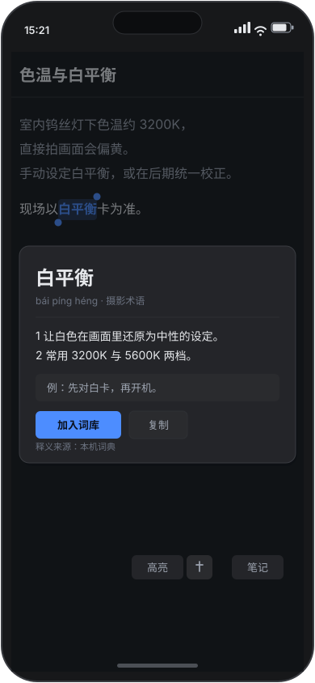

- **状态：仍未实现** ✗（2026-10-10）。⚠️ 桌面侧的查词**已实现**（`src/lib/dictionary/lookup.ts` ＋ `lookup.test.ts`），
  本屏的**移动端形态**未做 —— 两件事别混 ✓。

- **给谁用**：场景 3 的 owner，阅读时查一个词。
- **解决哪条需求**：**M-P2-1**（阅读时查词）。
- **关键交互**：选中一段文字（`--accent-soft` 高亮 ＋ 选择手柄）→ 浮出释义卡片（拼音 / 释义 / 例句）→ 按钮「加入词库」「复制」。
- **存哪里**：卡片注明「**释义来源：本机词典**」；⛔ 本屏不联网查词、不外发选中文本。
- **与桌面端的差别**：桌面查词在侧栏 / 弹层；本屏**就地浮卡、笔记不丢焦点**（与 M-P2-1 的验收口径同义）。

### 4.7 `07-settings.svg` —— 设置（高级入口指向桌面端）

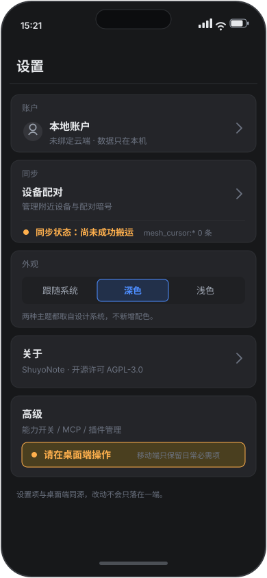

- **状态：未接线** ✗（2026-10-10）—— ⛔ **不是「已实现」**：组件与样式**已在仓里**
  （提交 `7a4f2fac`：`src/components/MobileSettings.tsx` ＋ `App.css` 的 `.mset*`），
  但 `App.tsx` **一行都没渲染它**（读数：`git show HEAD:src/App.tsx | grep -c MobileSettings` ⇒ **0**）。
  owner 2026-10-10 拍「**先不接**」⇒ 手机上的设置页保持老样子（**能用** ✓，只是不是本效果图的形态 ✗）；
  接线成果留在工作区未入库的 `_tmp/scratch/settings-07-wiring-20261010.patch`，随时可接回。

- **给谁用**：owner 本人，做账户 / 同步 / 外观这类低频设置。
- **解决哪条需求**：**M-P0-6**（写入走应用授权通道；本屏只做入口，不做写入本体）。
- **关键交互**：四项 账户 / 同步 / 外观 / 关于；同步行给「设备配对」入口（→ 010 屏）；
  高级入口（能力开关 / MCP / 插件管理）明确写「**请在桌面端操作**」。
- **存哪里**：仅本机设置；账户行写明「本地账户 · 未绑定云端 · 数据只在本机」。
- **与桌面端的差别**：桌面摆得下 26 条能力开关 / MCP / 插件管理（读数：底稿 C）；移动端**只保留日常必需项**。

### 4.8 `08-pair.svg` —— 设备配对 · 同步

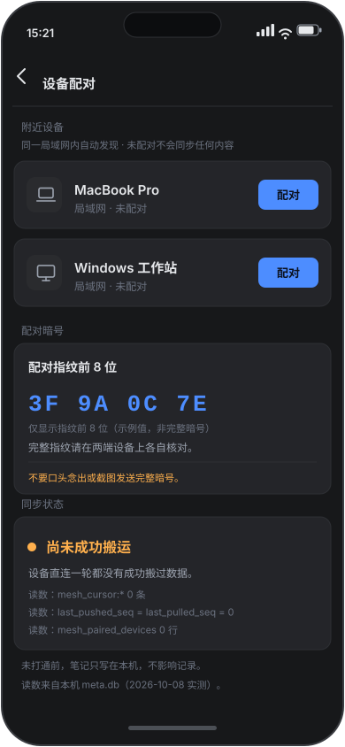

- **状态：仍未实现** ✗（2026-10-10）；且它依赖的同步通道**今天仍未搬通** ⇒ §6.2 的读数**仍然成立** ✓（不是过期项 ✗）。

- **给谁用**：owner ＋ 第二台设备（电脑）；对应**真机验收只能人看**（M-P0-5）。
- **解决哪条需求**：**M-P0-2**（这条同步到电脑）、**M-P0-5**（真机验收）。
- **关键交互**：附近设备列表（`MacBook Pro` / `Windows 工作站`，标「局域网 · 未配对」）→ 点「配对」；
  配对暗号**只显示指纹前 8 位**（`3F 9A 0C 7E`，示例值，非完整暗号）。
- **存哪里**：本屏**不产生任何可用暗号** —— 读数（底稿 E：`mesh_pair_secret:<room>:<self>` 值长 **0**，即当前无可用暗号）。
- **与桌面端的差别**：桌面没有这一屏；且本屏同步状态**如实写「尚未成功搬运」**并并列三条读数
  （`mesh_cursor:*` 0 条 · `last_pushed_seq = last_pulled_seq = 0` · `mesh_paired_devices` 0 行）。
- ⛔ **全目录不存在**暗号 / 密钥 / `mesh_pair_secret` 原文，读数（[`mockups/README.md`](./mockups/README.md) §3）。

---

## 5. 不做清单（七项，带理由）

| 不做 | 理由 |
|---|---|
| 全功能块编辑器移植 | 最小切片只需「记一条」（底稿 G）；能力面 26 条（底稿 C），全搬与切片无关。**口径：引擎保留、协作 UI 不做。** |
| 属性数据库编辑 | 底稿 C 的 26 条能力里没有为移动端设计的属性编辑面；形态**待量**。 |
| Ontology 图谱 | 同上，底稿 C 未列；与最小切片无关（底稿 G）。 |
| 视频生产流水线 | 与「记一条 ＋ 同步」无关（底稿 G）；owner 拍摄期产能约每周 3.5 天（底稿 G），不挪给无关面。 |
| 插件管理 | MCP 宿主面只绑回环（127.0.0.1）并认令牌（底稿 C），手机上「让外部 AI 写进手机笔记」**尚未设计、属待拍板**（底稿 C）。**口径：引擎保留、协作 UI 不做。** |
| 全库索引重建 | 与最小切片无关（底稿 G）；且块口径有陷阱 —— 同一页 `content_json` 20 块而 `blocks` 表 0 行、MCP `blocks_list` 返回 `[]`（底稿 D 教训 2）。 |
| MCP 配置 | 令牌 / 授权在移动端怎么摆**尚无设计**（底稿 C 原文）⇒ 待拍板；写入必须走应用授权通道并留审计（底稿 F）。 |

**另有一条选型上的「不做」**（技术侧，见 §7.3）：**HarmonyOS / NAPI 两条桥接明确不做**。

---

## 6. 非功能需求

| 项 | 要求 | 口径 / 依据 |
|---|---|---|
| 离线可用 | P0 全功能在无网下成立 | M-P0-3；写路径不得依赖网络 |
| 同步一致性 | ⚠️ **如实记**：设备直连**一轮都没成功搬过数据**（底稿 E）。所以 P0 的同步**不许假设它已可用**；一致性判据建立在「一遍搬运成功后：两侧页面与块数一致」之上 | 读数见 §6.2 |
| 耗电与后台同步 | 后台同步的耗电上限、唤醒频率 ⇒ **待量**；量法：真机同场景对比开 / 关后台同步的耗电 | 底稿未给读数 ⇒ 待量（不许编数） |
| 隐私与合规 | ① App Store 审核 ② 安卓备案 / 软著 ③ 个人信息保护法。所需材料清单与时长 ⇒ **待量** | 底稿未给读数 ⇒ 待量；纪律见底稿 F（不改数据库/配置/令牌绕应用通道，写入留审计） |
| 安装包体积 | 体积上限 ⇒ **待量**；量法用现成脚本 `check:android-bundle`（另有 `android:stage-pdfium`） | 读数（底稿 B：脚本族）；阈值待量 |
| 平台前提 | 无 WASM / 无 C ABI / 无 JNI / 无 FFI 目标；桥接只有 Tauri IPC | 读数（底稿 A：`wasm` / `no_mangle` / `extern "C"` / `cbindgen` / `uniffi` 全零命中；桌面桥接＝Tauri IPC） |

### 6.1 离线（P0 的硬要求）

写路径**不得依赖网络**：新建 → 输入 → 退出重进，内容必须在（M-P0-1 / M-P0-3）。
读数（底稿 D）：本地三件形态是 `content_json`（页面正文 JSON 文本）＋ `page_crdt.state`（Yjs 更新字节）＋ `changes`（未推送变更流水）。
⇒ 离线时三件都能在端上写；网络只影响「搬去别的设备」这一步（§6.2）。

### 6.2 同步一致性：**如实说「一轮都没成功搬过」**

⛔ **不许假设同步已可用。** 客观状态：**设备直连一轮都没成功搬过数据**
（窗口能起、8788 在听、日志报对了房间名），读数（底稿 E）。

**三个旁证（全部可机械核，读数：底稿 E）**：

1. `meta.db · sync_state` 里 `mesh_cursor:*` = **0 条**（全表 89 键）；`sync_profiles` 两行的 `last_pushed_seq` ＝ `last_pulled_seq` ＝ **0**。
2. `mesh_pair_secret:<room>:<self>` 值长 ＝ **0**（空值）—— 键在，配对没成；`mesh_token:<room>` 值长 13、`mesh_bind:<room>` 值长 12。
3. `mesh_paired_devices` ＝ **0 行**。

⇒ 跨端同步在移动端立项**之前**就是未收口项。**它是 M-P0-2 的前置**：
未收口前，M-P0-2 只能算「**待验收**」，⛔ 不能算「已通过」。
⇒ 一致性判据只能是：**一遍搬运成功后**，两侧同一页面的页面与块数一致（以 `content_json` 为块数口径，§7.4 教训 2）。

### 6.3 耗电 / 隐私合规 / 包体积

三项都是**待量**，且量法已写死（不许编数）：

- **耗电**：真机同场景对比「开后台同步 / 关后台同步」的耗电；上限值待量。
- **隐私合规**：App Store 审核 ＋ 安卓备案 / 软著 ＋ 个人信息保护法，所需材料清单与时长待量；
  这类材料**不受代码进度影响**，是最容易被低估的等待项 ⇒ 阶段 0 就启动（§9）。
- **包体积**：用现成脚本 `check:android-bundle` 量，阈值待量；另有 `android:stage-pdfium` 用于 PDF 阅读的资产准备。

---

## 7. 技术方案（压缩版，但仍自足）

### 7.1 架构总图

四条水平带，各端独立演进；**只有「共享 Rust 内核」这一层是跨端同一份代码**。

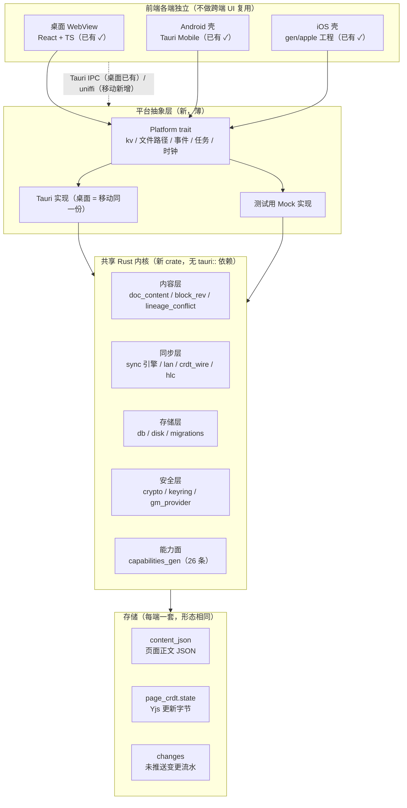

**读法**：跨端**不共享 UI**，共享的是内核与存储形态；平台抽象层是新写的、薄的、可 Mock 的。
**为什么不是「一套 Web UI 跑三端」**：桌面已有 WebView UI（读数：底稿 A，桌面端桥接＝Tauri IPC 已有 ✓），
而移动端三条现成回归门禁是**按移动端 DOM 结构**立的（读数：底稿 B）⇒ 强行统一 UI 会同时打破两端门禁。

### 7.2 共享内核的真实工作量：**435 处散在 45 个文件**

| 项 | 读数 | 来源 |
|---|---|---|
| Rust 侧规模 | **78 个 `.rs` ／ 70,152 行** | 底稿 A |
| 与 Tauri 的耦合总量 | **435 处 `tauri::`** | 底稿 A（`grep -ro "tauri::" src-tauri/src/*.rs \| wc -l`） |
| **含 `tauri::` 的文件数** | **45 个**（全仓 78 个 `.rs` 里的 45 个） | 复算（`grep -rc "tauri::" src-tauri/src/*.rs \| awk -F: '$2>0' \| wc -l`） |
| 最密的 6 个文件合计 | **222** ⇒ 占 **51%** | 复算：66+39+35+34+28+20 |
| **其余 39 个文件合计** | **213** ⇒ 占 **49%** | 复算：435 − 222 |
| WASM 目标 | **没有**（全仓 `wasm` 零命中） | 底稿 A |
| C ABI / JNI / FFI | **没有**（`no_mangle` / `extern "C"` / `cbindgen` / `uniffi` 零命中） | 底稿 A |
| `crates/` 目录 | 本仓尚不存在 ⇒ **待建** | 2026-10-08 补核（`ls -d crates` 无此目录） |

> ⚠️ **底稿 A 那句「耦合集中在这 6 个文件」说的是「最密的 6 个」，不是「全部 435 都在其中」。**
> 本说明书沿用修正后的读法：**45 个文件非零**；只清那 6 个文件**清不掉一半以上**的耦合。
> ⇒ 工期结论**偏悲观而非偏乐观**。

**最密的 6 个文件**（读数：底稿 A 给出处数）：

| 文件 | `tauri::` 处数 | 它的角色 | 切法 |
|---|---|---|---|
| `sync.rs` | 66 | 同步引擎 + 事件通知 | 引擎逻辑进 core；事件经 `Platform::emit` |
| `commands.rs` | 39 | IPC 命令胶水 | **不进 core**，留在壳里当平台层 |
| `email.rs` | 35 | 邮件聚合（网络 + 落库） | 网络/落库进 core；凭证读经 `Platform` |
| `attachments.rs` | 34 | 附件路径 + 文件 IO | 进 core；路径由 `Platform::data_dir` 给 |
| `plugins.rs` | 28 | 插件宿主（`boa_engine`） | 进 core；宿主生命周期挂在平台层 |
| `storage.rs` | 20 | 存储路径解析 | 拆成「路径来源（平台）」＋「存储实现（core）」 |

**其余 39 个文件的长尾**（复算，按处数降序取前几）：`community_publish.rs` 20 / `backup.rs` 16 /
`tags.rs` 14 / `lib.rs` 14 / `database.rs` 13 / `workspaces.rs` 10 …… 到 1 处的若干个。
共同点：**多数只在少数几行里碰 `tauri::`**（如 `AppHandle` 参数、`State<>` 注入、`Emitter::emit`）
⇒ 单个文件改动小，但**数量多**，是「逐处清理」的体力活，不是「重构 6 个模块」的技术活。

### 7.3 切成 `crates/core` 的五步，与桥接**只做一条**

**已经零耦合、可直接搬的 12 个模块**（读数：底稿 A，按行数降序）：

| 模块 | 行数 | 模块 | 行数 |
|---|---|---|---|
| `doc_content.rs` | 2522 | `crypto.rs` | 667 |
| `db.rs` | 1701 | `keyring.rs` | 493 |
| `lan.rs` | 1290 | `block_rev.rs` | 335 |
| `gm_provider.rs` | 720 | `lineage_conflict.rs` | 292 |
| `hlc.rs` | 710 | `capabilities_gen.rs` | 205 |
| `crdt_wire.rs` | 159 | `disk.rs` | 110 |

⚠️ **两条反直觉**：① 搬这 12 个模块**不会让 435 变小**（它们本来就零耦合），这一步的收益是
**建出 crate 骨架、把工具链和目标平台跑通**；② **435 不是「6 个文件的活」，是「45 个文件的活」**（§7.2）。

| 步骤 | 动作 | 产出 | 可量判据 |
|---|---|---|---|
| **Step 1** | 建 `crates/core`，原样搬 12 个零耦合模块（`git mv` 保历史） | `shuyonote-core` 可独立编译 | `cargo build -p shuyonote-core` ✓ 且**文件口径**：`grep -rc "tauri::" crates/core/src \| awk -F: '$2>0' \| wc -l` ⇒ **0 个文件** |
| **Step 2** | 定义 `Platform` trait（kv / data_dir / emit / spawn / now），桌面壳实现它；core 只认 trait | 435 的**依赖方向反转** | `grep -c "tauri" crates/core/Cargo.toml` ⇒ **0**；`cargo test -p shuyonote-core` 绿 |
| **Step 3a** | 清**最密的 6 个文件**（共 **222** 处＝**51%**）：逻辑搬进 core，只留 shim | 这 6 个文件在 core 侧无 `tauri::` | 每个文件：`grep -c "tauri::" crates/core/src/<file>.rs` ⇒ **0**（逐个签退，不一次算总账） |
| **Step 3b** | 清**长尾 39 个文件**（合计 **213** 处＝**49%**）：逐处把 `AppHandle` / `State<>` / `emit` 改成经 `Platform` | 长尾文件逐个归零 | **文件计数逐批下降**：非零文件数从 **45** 逐步降到「只剩壳层文件」（**目标：core 侧 0 个文件**） |
| **Step 4** | `commands.rs`（39）**不收进 core**，作为平台层保留；`lib.rs` 引导代码同样保留 | 剩余 `tauri::` ≤ 壳层胶水 | 总处数从 **435** 降到「仅在壳层文件内」，**且非零文件数可逐阶段对比** |
| **Step 5** | 移动端在 Step 1–2 完成后即可接（uniffi 只依赖 core） | Android / iOS 能用同一份 core | `cargo build -p shuyonote-core --target aarch64-linux-android` ✓ |

**排顺序的依据是「非零文件数」，不是「6 个文件」**：45 个非零文件 ⇒ 先清 6 个最密的（占 51%，
能把 `Platform` trait 的形状定下来），再**逐文件**清剩下 39 个（占 49%）。**Step 3b 是排期的主要不确定项。**

**桥接只做一条：uniffi**（一份 IDL 生成 Kotlin + Swift）。为什么不是另外几条：

| 方案 | 一次生成 Kotlin/Swift？ | 现有资产 | 内存 / 错误处理成本 | 结论 |
|---|---|---|---|---|
| **uniffi**（选） | ✓ 一份 IDL 生成两端绑定 | 零（本仓 `uniffi` 零命中，底稿 A）⇒ 从零接，但**只接一次** | 生成物负责装箱；`Result` → 两端 `throws`；checksum 防绑定漂移 | ✅ **只做这一条** |
| 手写 C ABI + JNI + Swift bridging header | ✗ 两条胶水各写一遍 | 零（`no_mangle` / `extern "C"` / `cbindgen` 零命中，底稿 A） | 手管内存 ＋ 手写异常映射 ⇒ 两类 bug 都自己扛 | ❌ 同样从零，却要写两遍 |
| NAPI | ✗（Node 宿主专属） | 无 | — | ❌ 见下 |
| WASM | — | **没有 WASM 目标**（底稿 A） | — | ❌ 前提不存在，且 SQLite / 钥匙串 / CRDT 要原生 |

**⛔ 明确不做：HarmonyOS / NAPI**

| 不做 | 理由（可核） |
|---|---|
| **HarmonyOS** | 仅在文档里被提到，**无实现**（读数：底稿 B）⇒ 接它等于**第三种 ABI 面 ＋ 一套零资产的工程**；需求侧**没有**客户请求 / 使用数据（读数：底稿 G）⇒ 无证据支撑这笔投入。**「只做一条桥接」本身就是不做它的理由**：第二条桥接的边际成本全在维护上。 |
| **NAPI** | 它是 **Node.js 宿主**的 ABI；移动端宿主是 Android / iOS 运行时，**不是 Node** ⇒ 映射不到目标平台（读数：底稿 A 记录「无 C ABI / JNI / FFI」；底稿 B 的移动端资产全是 Tauri / Android 脚本，无 Node 宿主）。 |

**过期条件**（写明什么情况下可以改这个决定）：出现**真实的**移动端用户请求数据，
或 Tauri 官方在目标平台断供 ⇒ 才重新评估第二条桥接。

### 7.4 数据形态与两条硬教训

| 数据 | 形态 | 说明 |
|---|---|---|
| 页面正文 | `content_json`（JSON 文本） | 读写的正本 |
| CRDT | `page_crdt.state`（Yjs 更新字节） | 合并用 |
| 变更流水 | `changes` | 未推送时**同实体合并成一行** |

读数：三种形态见底稿 D。

> **教训 1（会丢内容）**：页面**在编辑器里开着**时，从**外部**多次写入会被编辑器自动保存**写回旧版本**。
> 实测两次：写 19 块 ⇒ 回读 **3 块**；写 18 块 ⇒ 回读 **3 块**。
> 对照：**一次性写完则稳** —— 只写一次的页 **6 分钟守恒**，读数（底稿 D）。

- **技术对策**：外部写入必须**一次调用写完**（不拆多次）；写前检查目标页是否在编辑器里打开，
  **已打开则先落草稿、不直写**；写入后回读同一路径做**校验**（块数一致才报成功）。
- **判据**：同页连写两次 ⇒ 回读块数**不等于**期望值就判失败（把实测的 19→3、18→3 直接当回归用例）。

> **教训 2（口径陷阱）**：`blocks` 表 **≠** `content_json` 的块数。
> 实测同一页：`content_json` **20 块**，而 `blocks` 表 **0 行**、MCP `blocks_list` 返回 `[]`，读数（底稿 D）。

- **技术对策**：**一律以 `content_json` 为块数口径**；`blocks` 表只当「投影 / 索引」，
  投影滞后不得当成内容为空；任何「是否有内容」的判断⛔ 不许读 `blocks` 表。
- **判据**：构造 `content_json` 非空且 `blocks` 为空的页，UI **必须**显示内容（这就是那条 20 vs 0 的读数）。

**正面读数（可当基线用例）**：一次调用灌 **5424 字节** markdown ⇒ 该页 `content_json` **20 块**
（其中 **4 个 `type:"mermaid"` 图块），`content_text` **2928 字**，`page_crdt` **8970 字节**，
`updated_at` 停在调用时刻（**没被写回**），读数（底稿 D）。
⇒ 这条正好是「一次性写完」的正面样本，**把它固化成测试**。

### 7.5 能力面与 MCP 在移动端的边界

| 项 | 读数 | 来源 |
|---|---|---|
| 能力注册表 | **26 条**能力（生成物 `capabilities/capabilities.json` ＋ 11 个生成文件） | 底稿 C |
| 写能力 | **9 条** | 底稿 C |
| 其中走草稿（先看、确认才落库） | **6 条** | 底稿 C |
| 其中**直接落库** | **3 条**：`editor.insertText` / `kv.set` / `kv.remove` | 底稿 C |
| 四档开关 | `不接` / `只读` / `可写（每次确认）` / `可写（免确认）` | 底稿 C |
| ⚠️ 免确认档 | **写入不再逐次征询** | 底稿 C |
| MCP 宿主面 | **只绑回环 127.0.0.1**，认令牌；每次调用写审计 `plugin-audit.jsonl` | 底稿 C |

⛔ 注意：**写路径不止「先审后落库」一条** —— 9 条里只有 **6 条走草稿**，
`editor.insertText` / `kv.set` / `kv.remove` 这 **3 条直接落库**，读数（底稿 C）。

**映射到移动端 UI（要重摆一次，不能照抄）**：

| 桌面概念 | 移动端映射 | 理由 |
|---|---|---|
| 四档开关 | 保留四档，但**默认档位重设**；「免确认」在移动端**默认关闭**且需二次确认才能开 | 免确认档写入不逐次征询（底稿 C），移动端误触 / 丢失代价更高 |
| 26 条能力列表 | 折叠成「已授权的少数几条 ＋ 其余默认不接」 | 手机上列 26 条不可用 |
| 9 条写能力 | 逐条标注「草稿 / 直接落库」，**直接落库的 3 条在 UI 上显式标红** | 用户要能看见哪 3 条不问就走 |
| 审计 `plugin-audit.jsonl` | 保留，落 App 私有目录；移动端给「最近调用」一屏 | 审计是唯一事后追溯手段（底稿 C） |

**⛔「手机上让外部 AI 写进手机笔记」＝ 待拍板**（现状：**令牌与授权在移动端怎么摆，尚无设计**，读数：底稿 C）。
本文只列选项与风险，**不替 owner 决定**：

| 选项 | 做法 | 主要风险 | 与现有读数的关系 |
|---|---|---|---|
| A. 完全不暴露 | 移动端不启 MCP 宿主面 | 无新增风险 | 与「只绑回环」无冲突 |
| B. 回环 ＋ 令牌 | 照搬桌面形态（127.0.0.1 ＋ 令牌 ＋ 审计） | ⚠️ **手机上的「回环」不等于桌面上的隔离**：同机其它 App 也能访问 `127.0.0.1` ⇒ 必须 App 级鉴权、每会话令牌、令牌存钥匙串（`keyring` 已在零耦合清单里，读数：底稿 A） | 直接引用底稿 C 的机制，但**隔离假设要重新论证（待量）** |
| C. 出向交付 | 只允许 App **把内容交给**外部 AI（分享 / Intent / URL scheme），**不允许外部写进来** | 风险最低；功能面收窄 | 满足「写入走应用授权通道并留审计」（读数：底稿 F） |
| D. 暂不做 | 移动端不做外部 AI 写入 | 需求侧**无**客户请求 / 使用数据（读数：底稿 G）⇒ 这是零风险默认 | 与「先窄后宽」（底稿 G）一致 |

**待拍板要回答的三个问题**（本文只列，不给答案）：
① 令牌放哪（钥匙串 vs 应用私有文件）；② 免确认档在移动端是否允许存在；
③ 直接落库的 3 条（`editor.insertText` / `kv.set` / `kv.remove`）在移动端是否**降级为草稿**。

### 7.6 构建与 CI：复用现有的

| 项 | 现状（读数） | 复用法 |
|---|---|---|
| Android 出包 | `.github/workflows/android.yml` ✓（另有 `macos.yml` ✓ / `ci.yml` ✓ / `mesh-ten-devices.yml`） | **直接用**，加移动端新脚本挂到同一条 |
| 移动端回归 | `test:mobile-layout` / `test:mobile-views` / `test:mobile-overlays` | **三条必须常绿**（底稿 F） |
| 类型检查 | `npx tsc --noEmit` | 每阶段跑（底稿 F） |
| 仓级门禁 | `node scripts/test-report.mjs` ⇒ **61 条**（默认组；全部门禁 **80** 条，读数 [`../../TESTING.md`](../../TESTING.md):59） | 提交前全绿才提交（底稿 F） |

**`android.yml` 的三条已知边界（必须写进验收，别把 CI 绿当能发）**：

1. 它是**自检包**：带 `VITE_TEST_HOOKS=1`，**签名 ≠ 可以发版** ⇒ 对外发布另走 `release.yml`。
2. 它**只能手动触发**或本文件自身变更时跑 ⇒「推完记得去 Actions 看有没有新记录」是流程判据。
3. **构建能过 ≠ 运行时能用**：`boa_engine` 的 nan-boxing 在 Android 上曾让插件线程一起就 panic，
   靠 `src-tauri/Cargo.toml` 开 `jsvalue-enum` 修 ⇒ **真机验收那一步不能省**。

**要新增的四条 CI 判据**（明确列出，不藏在正文里）：

| 新增项 | 目的 | 判据 |
|---|---|---|
| 绑定版本一致性检查 | 防绑定 / 库漂移 | 一条「生成的 Kotlin / Swift 与 core 同版本」检查 ⇒ 绿 |
| core 无 Tauri 检查 | 防 `tauri::` 回流 | `grep -ro "tauri::" crates/core/src \| wc -l` ⇒ 0，进 CI |
| 移动端「一次性写入」回归 | 钉住教训 1 | 连写两次 ⇒ 回读块数一致 ⇒ 绿 |
| `content_json` 口径回归 | 钉住教训 2 | `content_json` 非空 ＋ `blocks` 空 ⇒ UI 有内容 ⇒ 绿 |

---

## 8. 验收与回归

**机器侧（必须常绿）**

1. 三条移动端门禁：`test:mobile-layout` / `test:mobile-views` / `test:mobile-overlays`，读数（底稿 B、F）。
2. 提交前全绿：`node scripts/test-report.mjs`（**61 条**，默认组）＋ `npx tsc --noEmit`，读数（底稿 F）。
3. 三条 `test:mobile-*` 任一红 ⇒ 该次提交不成立（底稿 F）。

**人侧（机器读数不替代）**

4. 真机验收**只能由人看**（截图 / 手感），读数（底稿 F）。
5. 人签收项：M-P0-1 记一条、M-P0-2 电脑侧读到、M-P0-3 飞行模式不丢。

**红线**

6. 不改数据库 / 配置，不用令牌绕过应用通道；一切写入走应用授权通道并留审计，读数（底稿 F、C）。

**未收口项（必须在验收里点名）**

7. 设备直连一轮都没成功搬过数据（底稿 E）。**它是 M-P0-2 的前置**：未收口前，
   M-P0-2 只能算「**待验收**」，⛔ 不能算「已通过」。

---

## 9. 分阶段路线（先窄后宽）

> 依据：owner 同期有纪录片拍摄（**2026-10-10 开机，约每周 3.5 天**），且需求侧**没有**客户请求 / 评论 / 使用数据
> ⇒ 范围必须先窄：**「手机上记一条 ＋ 同步到电脑」**是最小可验收切片，读数（底稿 G）。

| 阶段 | 交付物 | 可测验收口径 | 退出条件 |
|---|---|---|---|
| **阶段 0：打磨现有 Android 壳** | 用现有 18 个 android/mobile 脚本把壳做稳（图标 / 名称 / 启动页 / 竖屏锁 / OpenSSL / 加密 / 打包） | 三条 `test:mobile-*` 绿 ＋ `npx tsc --noEmit` 绿 ＋ `node scripts/test-report.mjs` **60/60** ＋ Actions 里 `Android (build)` 有**成功**记录 ＋ **人**在真机上能打开并编辑一条 | 上述五条**全绿**；任一条红 ⇒ 不进入阶段 1 |
| **阶段 1：最小切片（记一条 ＋ 同步到电脑）** | ① `crates/core` Step 1–2（§7.3）② 一条「记一条」写入通道 ③ 一条搬移通道 | **先过 §10.1 同步闸门**（四个读数从 0 变非 0）**或** owner 拍板的兜底路径；然后：手机记一条 ⇒ 电脑看到同一条 ⇒ **内容一致**；再跑「连写两次」回归（教训 1）与「`content_json` vs `blocks`」回归（教训 2）全绿 | 内容一致性 ＋ 两条教训回归 ＋ 阶段 0 的五条基线**保持绿** |
| **阶段 2：搜索 ＋ 阅读** | 全文搜索入口；移动端阅读视图（PDF 已有 `android:stage-pdfium` 脚本可复用） | 搜索：在**待量的**样本集上给出结果并与桌面结果一致（**待量**：样本页数与耗时可接受线）；阅读：真机上打开文档、翻页 / 缩放无崩溃 | 搜索结果一致 ＋ 阅读无崩溃 ＋ 阶段 1 验收保持绿 |
| **阶段 3：划词查词 / 轻量 AI** | 划词查词；轻量 AI（**走 §7.5 能力面**，⛔ 不许绕过授权） | 26 条能力映射到移动端 UI；9 条写能力按 6 草稿 / 3 直落执行；「免确认」默认关闭；`plugin-audit.jsonl` 有记录 | 能力面映射核过 ＋ 审计有记录 ＋ 阶段 2 验收保持绿 |

**每阶段的共同退出纪律**：三条 `test:mobile-*` ＋ `tsc` ＋ 61 条门禁（默认组）**全绿**才提交；
真机那一格**必须是人**填的（读数：底稿 F）。

**为什么不是「先做同步再做 UI」或「先做 AI」**：同步是**前置依赖而非阶段**（§10.1），
AI 依赖能力面与同步都已收口；而「记一条」是唯一能在同步闸门不过时**仍然有产出**的切片。

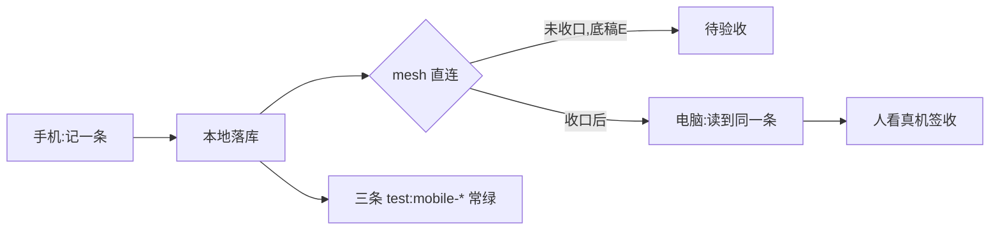

---

## 10. 同步闸门与风险表

### 10.1 ⛔ 同步闸门（从 0 变非 0，全部可机械核）

**「同步可用」是阶段 1 的前置依赖。闸门不过 ⇒ 阶段 1 不开工。**

| 闸门读数 | 现值 | 要求 |
|---|---|---|
| `mesh_cursor:*` 条数 | **0**（全表 89 键） | **≥ 1** |
| `sync_profiles` 的 `last_pushed_seq` 与 `last_pulled_seq` | **0** | **> 0** |
| `mesh_pair_secret:<room>:<self>` 值长 | **0** | **> 0** |
| `mesh_paired_devices` 行数 | **0 行** | **≥ 1 行** |
| 一条真实的「A 机写 → B 机读到且内容一致」记录 | **无** | 有 |

读数：全部见底稿 E。

**闸门不过时的兜底**（⛔ 不许悄悄绕过）：改用**文件导出 / 导入**这一条最小搬移路径做阶段 1 的临时验收；
或把「同步收口」另立一个前置工作项。**两条都要 owner 拍板（§11），本文不替他选。**

### 10.2 风险表

| # | 风险 | 触发信号（可观测） | 应对 | 判据 |
|---|---|---|---|---|
| 1 | **切 crate 工作量被低估（尤其长尾）** | Step 3a 某文件搬迁后 `cargo test -p shuyonote-core` 红；或 Step 3b **非零文件数不降**（45 卡住），个别文件「只差一行」反复来回 | 拆成更小的步；**逐个文件签退**，不一次算总账；先保 Step 1–2 的可用产物；**长尾按文件数排期，不按处数排期** | 总处数从 **435** 递减；**文件口径**从 **45** 递减；core 侧 ⇒ **0 个文件** |
| 2 | **桥接维护成本（第二条桥接最贵）** | 同一 API 要改两处绑定；两端行为不一致的 bug 单 | **只做一条**（uniffi）；HarmonyOS / NAPI 明确不做 | 仓库里绑定生成物**只有一套**；`uniffi` 单点 |
| 3 | **移动端后台同步耗电** | 真机耗电排行里本 App 靠前；后台被系统杀 ⇒ 同步中断 | 同步只在**前台 / 充电 / Wi-Fi** 条件下跑；频繁轮询改为事件驱动 | 真机观测（**人判**）；同步中断次数可统计（**待建**埋点） |
| 4 | **上架 / 审核卡住** | 提交后审核驳回或长时间无回音；备案材料未齐 | 备案 / 软著**阶段 0 就启动**；排期不贴发布日 | 材料齐 ＋ 审核通过记录 |
| 5 | **网格未通（同步不可用）** | `mesh_cursor:*` = 0、pushed/pulled = 0、`mesh_pair_secret` 值长 0、`mesh_paired_devices` 0 行（**现值全命中**，读数：底稿 E） | **当闸门**：不过就不进阶段 1；走 owner 拍板的兜底搬移路径 | §10.1 四条读数**全部**从 0 变非 0 |
| 6 | **一人产能（每周 3.5 天）** | 阶段内没有可演示产出；周对比停滞 | 阶段 0–1 只做最小切片；阶段 2–3 **不排死期** | 每阶段都有**可演示**的退出物（不是「进度百分比」） |
| 7 | **外部写丢内容** | 回读块数 < 期望（实测 19→3、18→3，读数：底稿 D） | 一次性写完；开着的页走草稿；写后回读校验 | 「连写两次」回归绿 |
| 8 | **口径陷阱（把投影当正本）** | `blocks` 表 0 行而 `content_json` 20 块（读数：底稿 D） | 一律以 `content_json` 为块数口径 | 该读数固化成用例 |
| 9 | **免确认档被打开** | 移动端设置里「可写（免确认）」为开；写入不再逐次征询（读数：底稿 C） | 默认关；开启需二次确认；3 条直接落库能力在 UI 标红 | 默认档位 ＋ 审计记录 |

---

## 11. 待 owner 裁决

⛔ 本文只列选项与风险，**不替 owner 拍板**。两条各带「**沉默 ⇒ 取零风险默认**」。

### 11.1 立项：这条产品线要不要做

> ⚠️ **2026-10-10 更新：本节已结案** ✓ —— owner 2026-10-09 拍「**做成产品线**」，走的是**选项 A（做）**
> （读数：[`STATUS-2026-10-10.html`](./STATUS-2026-10-10.html) §④「立项口径」逐字「移动端立项＝**做** ✓」）。
> 下面两个选项与「沉默 ⇒ 不立项」**保留作当时的决策记录**，⛔ **不再**当作当前状态的读数 ✗。

- **选项 A（做）**：按 §9 从阶段 0 起，先窄后宽。收益读数：Android 壳已是 Tauri（底稿 B）、
  内核可切（底稿 A）、三条门禁已有（底稿 B）。
- **选项 B（暂不做）**：只保留本说明书与需求 / 效果图 / 技术方案，不动代码。代价读数：
  需求侧**没有**任何客户请求 / 评论 / 使用数据（底稿 G）⇒ 现在做的依据是场景推演。
- **风险**：owner 同期纪录片 **2026-10-10 开机**、约**每周 3.5 天**（底稿 G）⇒ 立项即挤压拍摄期。
- **沉默 ⇒ 取零风险默认**：**不立项**（保持「规划」状态，不动代码、不排期）。
  理由是「没有真实需求数据 ⇒ 不投入产能」是零风险的一侧；要做请显式拍板。

### 11.2 同步通道口径：局域网直连 vs 先落本地等 mesh 收口

- **选项 A（局域网直连）**：阶段 1 的「同步到电脑」走 mesh 直连。前置＝§10.1 闸门四条读数从 0 变非 0；
  **现值全部命中「未收口」**（底稿 E）。
- **选项 B（先落本地，等 mesh 收口）**：阶段 1 只验收「记一条」（本机可测、今天就能做），
  同步另立前置工作项；若要临时搬移，走**文件导出 / 导入**这一条最小路径。
- **风险**：选 A 而 mesh 一直不通 ⇒ 阶段 1 卡死在 M-P0-2；选 B ⇒ 跨端体验推迟，但每一阶段都有可演示产出。
- **沉默 ⇒ 取零风险默认**：**选项 B**（先落本地 ＋ 同步另立前置项）。
  理由是它不假设一个**一轮都没成功搬过数据**（底稿 E）的通道已可用。

### 11.3 附带待拍板（技术侧，见 §7.5）

「手机上让外部 AI 写进手机笔记」＝ 待拍板（现状：令牌与授权在移动端怎么摆**尚无设计**，读数：底稿 C）。
- **沉默 ⇒ 取零风险默认**：**选项 D「暂不做」**（移动端不做外部 AI 写入），
  理由是需求侧**无**客户请求 / 使用数据（底稿 G），且与「先窄后宽」一致。

---

## 12. 附录

### 12.1 术语

| 术语 | 在本篇里的意思 |
|---|---|
| **CRDT** | 无中心冲突消解的数据类型。本产品用 Yjs 更新字节存进 `page_crdt.state`，读数（底稿 D）。 |
| **`content_json`** | 页面正文的正本（JSON 文本）。**块数一律以它为准**，读数（底稿 D 教训 2）。 |
| **`blocks` 表** | 正文的**投影 / 索引**，不是正本。实测同一页 `content_json` 20 块而它 0 行，读数（底稿 D）。 |
| **`changes`** | 变更流水；未推送时**同实体合并成一行**，读数（底稿 D）。 |
| **mesh（网格 / 设备直连）** | 设备之间不经服务器的直连搬移通道（局域网发现 ＋ 8788 端口监听 ＋ 配对暗号）。**当前未收口**，读数（底稿 E）。 |
| **`mesh_pair_secret`** | 配对暗号（密钥材料）。当前值长 **0**，即无可用暗号，读数（底稿 E）。 |
| **配对指纹前 8 位** | 效果图上**只显示**的暗号片段（示例 `3F 9A 0C 7E`）。⛔ 全目录不存在完整暗号原文，读数（[`mockups/README.md`](./mockups/README.md) §3）。 |
| **能力（capability）** | 应用对外暴露的可调用面。共 **26 条**，其中写 **9 条**，读数（底稿 C）。 |
| **草稿（写能力的两条路径之一）** | 先给用户看、**确认才落库**。9 条写能力里 **6 条**走这条，读数（底稿 C）。 |
| **直接落库** | 不逐次征询就写库。**3 条**：`editor.insertText` / `kv.set` / `kv.remove`，读数（底稿 C）。 |
| **四档开关** | `不接` / `只读` / `可写（每次确认）` / `可写（免确认）`，读数（底稿 C）。 |
| **MCP 宿主面** | 外部 AI 客户端接进来的那一层。桌面**只绑回环 127.0.0.1**、认令牌、每次调用写 `plugin-audit.jsonl`，读数（底稿 C）。 |
| **uniffi** | 选定的跨语言桥接：一份 IDL 生成 Kotlin ＋ Swift 绑定（§7.3）。 |
| **`Platform` trait** | 平台抽象层的接口（kv / data_dir / emit / spawn / now），让 core 不认 `tauri::`（§7.3 Step 2）。 |
| **免确认档** | 四档里最高的一档，**写入不再逐次征询**；移动端默认关闭，读数（底稿 C）。 |
| **自检包** | `android.yml` 产出的带 `VITE_TEST_HOOKS=1` 的包，**签名 ≠ 可以发版**（§7.6）。 |

### 12.2 本篇引用的底稿编号索引

| 编号 | 底稿内容 | 本篇用到的地方 |
|---|---|---|
| **A** | 内核与平台耦合（78 `.rs` / 70,152 行 / 435 处 `tauri::` / 最密的 6 个文件 / 12 个零耦合模块 / 无 WASM / 无 FFI） | §1、§3.3、§6、§7.1、§7.2、§7.3、§7.5 |
| **A+** | 底稿 A 的补充读数（2026-10-08 复算）：435 散在 **45 个文件**；最密 6 个 **222（51%）**；其余 39 个 **213（49%）** | 开头四不许 ④、§7.2、§9、§10.2 |
| **B** | 移动端已有资产（`gen/apple` / 18 个脚本 / 4 条 workflow / 3 条 `test:mobile-*` / 壳已是 Tauri） | §1、§3.1、§3.2、§3.3、§5、§6、§7.1、§7.3、§7.6、§8 |
| **C** | 能力面与授权（26 条 / 写 9 条 / 6 草稿 3 直落 / 四档开关 / MCP 回环＋令牌＋审计 / 移动端待拍板） | §3、§4.3、§5、§7.5、§10.2、§11.3、§12.1 |
| **D** | 数据面与两个硬教训（`content_json` ＋ `page_crdt` ＋ `changes` / 19→3、18→3 / 20 块 vs 0 行 / 5424 字节正面样本） | §3.1、§4.2、§5、§6.1、§7.4、§8、§10.2、§12.1 |
| **E** | 同步 / 网格现状（`mesh_cursor:*` 0 / pushed·pulled 0 / `mesh_pair_secret` 值长 0 / `mesh_paired_devices` 0 行 / 从未搬过） | §1、§4（04/010 屏）、§6.2、§9、§10.1、§10.2、§11.2、§12.1 |
| **F** | 流程与验收纪律（61 条默认组门禁 / `tsc` / 真机只能人看 / 三条移动端回归常绿 / 不许绕过应用通道） | §3.1、§6、§7.6、§8、§9 |
| **G** | 产能与优先级（纪录片 2026-10-10 开机 / 每周 3.5 天 / 无客户请求数据 / 最小切片） | §1、§2、§3、§5、§7.3、§7.5、§9、§11 |

### 12.3 这份说明书的边界

- 本篇是**三份交付物的合并版**，不是四份新工作；被合并的三份仍各自有效（需求 / 效果图 / 技术方案）。
- **界面：3 屏已实现 / 7 屏未实现**（2026-10-10）：§4.1 首页 ＋ §4.2 快速记录 ＋ §4.9 启动页**已落地** ✓
  （提交 `de50d59e`／`e5c5c295`／`d5757a61`）；§4.7 设置**组件在、未接线** ✗（owner 拍「先不接」）；其余 6 屏**仍未实现** ✗。
  ⚠️ 本行原文是「**界面未实现**：§4 只有 10 张 SVG 效果图」—— **已过期** ✗（读数：§4 各屏自己的状态行）。
- **真机验收只能由人看**（M-P0-5，读数：底稿 F）：效果图不等于手感，截图不等于真机。
  ⚠️ 2026-10-10 又添一条实证：iOS 真机上 `devicectl` 装/启动**都返回成功、进程也活着**，而画面是**白屏** ✗
  ⇒ **「启动通过」不等于「界面起来了」**；完整读数见 `docs/MOBILE.md` 的「iOS 现状」一节。
- **立项已由 owner 拍板**（2026-10-09 拍「做成产品线」；读数：[`STATUS-2026-10-10.html`](./STATUS-2026-10-10.html) §④）。
  ⚠️ 本行原文是「**立项本身待 owner 裁决**」—— **已过期** ✗；今天仍待拍的只剩 §11.2／§11.3。
- 数字口径：凡本篇出现的读数都可回溯到上面那张索引表的底稿节；底稿没给的写「**待量**」。
