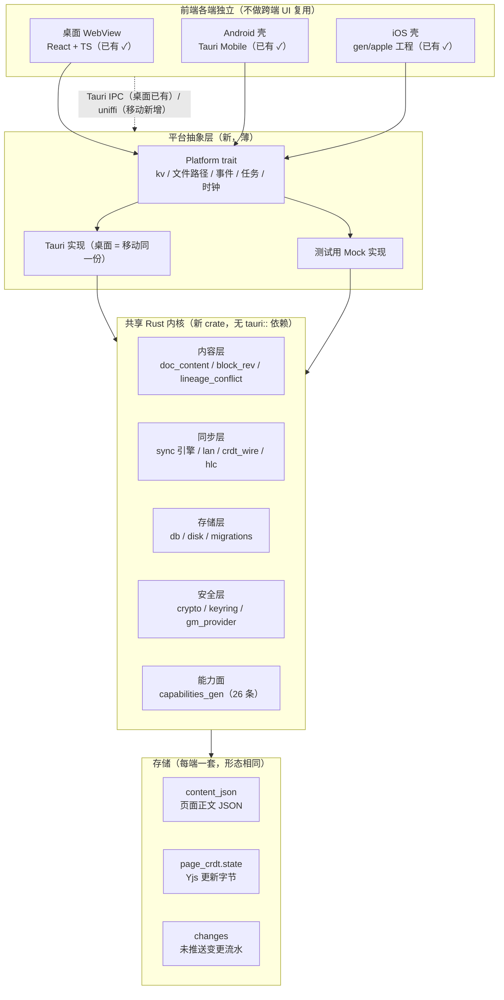

# 移动端详细技术方案（2026-10-08）

状态：草案（待 owner 拍板；同步闸门未过 ⇒ 阶段 1 不得开工）

> **事实来源**：`_tmp/scratch/mobile-facts.md`（A–G 七节，2026-10-08 实测逐字读数）。
> 本文所有数字后面都写 `读数（来源）`；底稿没给的写「**待量**」，不编。
> 本文只谈**怎么做**；范围依据在需求说明书，界面依据在高保真效果图。
>
> ⛔ 三条本文**不许出现**的错误结论（逐条反着写）：
> ① 不说 Web 端有 WASM 可复用 —— **没有 WASM 目标**（读数：底稿 A，`wasm` 零命中）。
> ② 不把「Tauri Mobile 是否可行」当问句 —— **现有 Android 壳已经在用 Tauri**（读数：底稿 B，18 个 android/mobile npm 脚本即证）。
> ③ 不写「写操作一律审核落库」 —— 写能力 9 条里**只有 6 条走草稿**，另 3 条**直接落库**（读数：底稿 C）。

---

## 0. 结论摘要（先看这 8 行）

1. **架构**：前端各端独立，中间一层平台抽象，共享 Rust 内核，存储按端落地（§1）。
2. **切内核的机器活不大，人事活大，而且比看上去更散**：零耦合的 12 个模块能直接搬（读数：底稿 A）；**搬 12 个模块不会让 435 变小**（它们本来就零耦合），而 435 处 `tauri::` **散在 45 个文件里**、最大的 6 个文件只占 **222（51%）**（读数：2026-10-08 复算，见 §2.2）⇒ 剩下 **213 处**要**逐文件**清（§2）。
3. **桥接只做一条**：uniffi，一次 IDL 生成 Kotlin + Swift（§3）。
4. **HarmonyOS / NAPI 明确不做**：无实现、无资产、无需求证据（读数：底稿 B、G）（§3.4）。
5. **同步不是地基，是前置依赖**：设备直连**一轮都没成功搬过数据**（读数：底稿 E）⇒ 方案不得假设它已可用，阶段 1 必须**先过同步闸门**（§4.3、§7）。
6. **两个已知会丢内容的坑必须进代码**：外部多次写入被自动保存写回（19→3、18→3 块）、`blocks` 表 ≠ `content_json` 块数（读数：底稿 D）（§4.2）。
7. **能力面照搬、UI 另设**：26 条能力 / 写 9 条 / 四档开关映射到移动端要**重新摆一次开关**（读数：底稿 C）（§5）。
8. **「手机上让外部 AI 写进手机笔记」= 待拍板**：本文只给选项与风险，不替 owner 决定（§5.3）。

---

## 1. 架构总图

四条水平带，各端独立演进；**只有「共享 Rust 内核」这一层是跨端同一份代码**。

**读法**：跨端**不共享 UI**，共享的是内核与存储形态；平台抽象层是新写的、薄的、可 Mock 的。
**为什么不是「一套 Web UI 跑三端」**：桌面已有 WebView UI（读数：底稿 A，桌面端桥接＝Tauri IPC 已有 ✓），
而移动端三条现成回归门禁是**按移动端 DOM 结构**立的（读数：底稿 B）⇒ 强行统一 UI 会同时打破两端门禁。

---

## 2. 「共享内核」的可行性与工作量

### 2.1 现状真数

| 项 | 读数 | 来源 |
|---|---|---|
| Rust 侧规模 | 78 个 `.rs` ／ 70,152 行 | 底稿 A |
| 与 Tauri 的耦合总量 | **435 处 `tauri::`** | 底稿 A |
| 已有移动端壳 | Android 壳**就是** Tauri（18 个 android/mobile npm 脚本） | 底稿 B |
| WASM 目标 | **没有**（零命中） | 底稿 A |
| C ABI / JNI / FFI | **没有**（`no_mangle`／`extern "C"`／`cbindgen`／`uniffi` 零命中） | 底稿 A |
| `crates/` 目录 | 本仓尚不存在（本方案作者核对：`ls -d crates` 无此目录） ⇒ **待建** | 2026-10-08 补核 |

### 2.2 435 处的真实分布：**45 个文件**，最大的 6 个只占 51%

| 读数 | 值 | 来源 |
|---|---|---|
| `tauri::` 总处数 | **435** | 底稿 A（`grep -ro "tauri::" src-tauri/src/*.rs \| wc -l`） |
| **含 `tauri::` 的文件数** | **45**（全仓 78 个 `.rs` 里的 45 个） | 复算：`grep -rc "tauri::" src-tauri/src/*.rs \| awk -F: '$2>0' \| wc -l` |
| 最大的 6 个文件合计 | **222** ⇒ 只占 **51%** | 复算：66+39+35+34+28+20 |
| **其余 39 个文件合计** | **213** ⇒ 占 **49%** | 复算：435 − 222 |

> ⚠️ **底稿 A 那句「耦合集中在这 6 个文件」说的是「最密的 6 个」，不是「全部 435 都在其中」。**
> 本方案初稿曾把它读成后者（「435 全在 6 个文件里」），**已按复算改正**：
> 只清那 6 个文件**清不掉一半以上**的耦合。

**最密的 6 个文件**（读数：底稿 A 给出处数）：

| 文件 | `tauri::` 处数 | 它的角色 | 切法 |
|---|---|---|---|
| `sync.rs` | 66 | 同步引擎 + 事件通知 | 引擎逻辑进 core；事件经 `Platform::emit` |
| `commands.rs` | 39 | IPC 命令胶水 | **不进 core**，留在壳里当平台层 |
| `email.rs` | 35 | 邮件聚合（网络 + 落库） | 网络/落库进 core；凭证读经 `Platform` |
| `attachments.rs` | 34 | 附件路径 + 文件 IO | 进 core；路径由 `Platform::data_dir` 给 |
| `plugins.rs` | 28 | 插件宿主（boa_engine） | 进 core；宿主生命周期挂在平台层 |
| `storage.rs` | 20 | 存储路径解析 | 拆成「路径来源（平台）」＋「存储实现（core）」 |

**其余 39 个文件的长尾**（复算，按处数降序取前几）：`community_publish.rs` 20／`backup.rs` 16／
`tags.rs` 14／`lib.rs` 14／`database.rs` 13／`workspaces.rs` 10 …到 1 处的若干个。
它们的共同点：**多数只在少数几行里碰 `tauri::`**（如 `AppHandle` 参数、`State<>` 注入、
`Emitter::emit`）⇒ 单个文件改动小，但**数量多**，是「逐处清理」的体力活，不是「重构 6 个模块」的技术活。

读数出处：上表 6 行与长尾清单见上（来源：底稿 A 给出 6 个文件的处数；**45／222／213 三个数由 2026-10-08 Lead 复算、本方案作者复跑一致**）。

### 2.3 已经零耦合、可直接搬的 12 个模块

按行数从大到小（读数：底稿 A）：

| 模块 | 行数 | 模块 | 行数 |
|---|---|---|---|
| `doc_content.rs` | 2522 | `crypto.rs` | 667 |
| `db.rs` | 1701 | `keyring.rs` | 493 |
| `lan.rs` | 1290 | `block_rev.rs` | 335 |
| `gm_provider.rs` | 720 | `lineage_conflict.rs` | 292 |
| `hlc.rs` | 710 | `capabilities_gen.rs` | 205 |
| `crdt_wire.rs` | 159 | `disk.rs` | 110 |

合计 12 个模块（读数：底稿 A「已经零耦合」清单）。**它们是内核算法的全部承重件**：
内容层（`doc_content`／`block_rev`／`lineage_conflict`）、同步层（`lan`／`crdt_wire`／`hlc`）、
存储层（`db`／`disk`）、安全层（`crypto`／`keyring`／`gm_provider`）、能力面（`capabilities_gen`）。

### 2.4 切成 `crates/core` 的清单与顺序

> ⚠️ **先说两条反直觉的**：
> ① 搬这 12 个模块**不会让 435 减少**——它们本来就零耦合。
> 这一步的收益是：**建出 crate 骨架、把工具链和目标平台（Android/iOS）跑通**。
> 真正吃掉 435 的是 Step 2–4 的重构。**不要把 Step 1 当成工期的代表。**
> ② **435 不是「6 个文件的活」，是「45 个文件的活」**（§2.2）：最密的 6 个只占 **222（51%）**，
> 剩下 **213（49%）散在另外 39 个文件里**。⇒ 工期结论**偏悲观而非偏乐观**：
> Step 1 之后要动的是 **45 个文件里逐处清理**，其中 39 个文件是「每个只碰几行、但数量多」的长尾。

| 步骤 | 动作 | 产出 | 可量判据 |
|---|---|---|---|
| **Step 1** | 建 `crates/core`，原样搬 12 个零耦合模块（`git mv` 保历史） | `shuyonote-core` 可独立编译 | `cargo build -p shuyonote-core` ✓ 且 **文件口径**：`grep -rc "tauri::" crates/core/src \| awk -F: '$2>0' \| wc -l` ⇒ **0 个文件** |
| **Step 2** | 定义 `Platform` trait（kv／data_dir／emit／spawn／now），桌面壳实现它；core 只认 trait | 435 的**依赖方向反转** | `grep -c "tauri" crates/core/Cargo.toml` ⇒ **0**；`cargo test -p shuyonote-core` 绿 |
| **Step 3a** | 清**最密的 6 个文件**（`sync`/`commands`(留壳)/`email`/`attachments`/`plugins`/`storage`，共 **222** 处＝**51%**）：逻辑搬进 core，只留 shim | 这 6 个文件在 core 侧无 `tauri::` | 每个文件：`grep -c "tauri::" crates/core/src/<file>.rs` ⇒ **0**（逐个签退，不一次算总账） |
| **Step 3b** | 清**长尾 39 个文件**（合计 **213** 处＝**49%**）：逐处把 `AppHandle`／`State<>`／`emit` 改成经 `Platform` | 长尾文件逐个归零 | **文件计数逐批下降**：`grep -rc "tauri::" src-tauri/src/*.rs \| awk -F: '$2>0' \| wc -l` 从 **45** 逐步降到「只剩壳层文件」（**目标：core 侧 0 个文件**） |
| **Step 4** | `commands.rs`（39）**不收进 core**，作为平台层保留；`lib.rs` 引导代码同样保留 | 剩余 `tauri::` ≤ 壳层胶水 | `grep -ro "tauri::" src-tauri/src/*.rs \| wc -l` 从 **435** 降到「仅在壳层文件内」，**且非零文件数可逐阶段对比** |
| **Step 5** | 移动端在 Step 1–2 完成后即可接（§3 uniffi 只依赖 core） | Android/iOS 能用同一份 core | `cargo build -p shuyonote-core --target aarch64-linux-android` ✓ |

**排顺序的依据是「非零文件数」，不是「6 个文件」**：45 个非零文件 ⇒ 先清 6 个最密的（占 51%，
能把 `Platform` trait 的形状定下来），再**逐文件**清剩下 39 个（占 49%）。
**Step 3b 是排期的主要不确定项**——它的文件数多、单个改动小，最容易在估算里被漏掉。

**为什么不是「先拆那 6 个最密的文件、再建 crate」**：那样重构期间**没有目标 crate 可落**，
重构成果只能堆在原处，一旦中断就退回起点；而 Step 1 是一次性、可回滚、先拿到编译目标平台的能力。

**为什么不是「整仓搬进一个 crate，靠条件编译排除 Tauri」**：`tauri::` 是 435 处**调用点**，
不是依赖声明——`#[cfg]` 只能切依赖，切不掉调用点，最后会得到 435 个 `#[cfg(mobile)]`，
比重构更难维护（这是选型对比，见 §3 表同款理由）。

### 2.5 回归底线（每一步都要跑）

- `node scripts/test-report.mjs` ⇒ **60 条**（读数：底稿 F）。
- `npx tsc --noEmit`（读数：底稿 F）。
- 三条 `test:mobile-layout`／`test:mobile-views`／`test:mobile-overlays` **必须常绿**（读数：底稿 B、F）。
- 判据：**步与步之间对上述四条读数做前后对比**，任一红即回滚该步，不带着红往前。

---

## 3. 跨语言桥接选型（**只做一条**）

### 3.1 对比表（为什么选 uniffi，为什么不是另外几条）

| 方案 | 一次生成 Kotlin/Swift？ | 现有资产 | 内存/错误处理成本 | 结论 |
|---|---|---|---|---|
| **uniffi**（选） | ✓ 一份 IDL 生成两端绑定 | 零（本仓 `uniffi` 零命中，底稿 A） ⇒ 从零接，但**只接一次** | 生成物负责装箱；`Result` → 两端 `throws`；checksum 防绑定漂移 | ✅ **只做这一条** |
| 手写 C ABI + JNI + Swift bridging header | ✗ 两条胶水各写一遍 | 零（`no_mangle`／`extern "C"`／`cbindgen` 零命中，底稿 A） | 手管内存 + 手写异常映射 ⇒ 两类 bug 都自己扛 | ❌ 同样从零，却要写两遍 |
| NAPI | ✗（Node 宿主专属） | 无 | — | ❌ 见 §3.4 |
| WASM | — | **没有 WASM 目标**（底稿 A） | — | ❌ 前提不存在，且 SQLite/钥匙串/CRDT 要原生 |

### 3.2 C ABI 边界设计要点（无论谁生成，边界语义只有这四条）

**① 错误怎么传**：core 对外只暴露 `Result<T, CoreError>`，`CoreError` 是**扁平枚举**
（`kind` = 稳定字符串码 ＋ `message` 给日志）——不把 Rust 的 panic 跨越 FFI。
边界函数一律 `catch_unwind` 兜住 panic，转成 `CoreError::Panic`；**panic 不许跨语言栈**。
两端 UI 只按 `kind` 分支，`message` 只用于上报（不解析文案）。

**② 异步怎么等**：core 内部持有**一个** runtime（不是每次调用建一个）。
uniffi 的 async 函数在 Kotlin 侧是 `suspend`、Swift 侧是 `async` ⇒ 调用方用各自的等待原语，
**不要在边界上开线程池**。长任务（同步一轮、附件下载）返回**句柄 + 进度事件**，
而不是让一次调用阻塞几十秒。

**③ 内存谁释放**：**Rust 分配的交回 Rust 释放**。
跨界的只能是「拷贝出去的拥有型值」（`Vec<u8>`／`String`／生成的对象）；
**不许把借用指针或 `&str` 递给上层长期持有**。若将来确有 C ABI 直通需求，
只允许「长度前缀缓冲 ＋ 对应的 `*_free`」这一种形态，且 `*_free` 必须由同一个 crate 导出。

**④ 版本与漂移**：绑定与库**同版本发布**；uniffi 生成物带 checksum，
版本不匹配时**启动即失败**，不许「半可用」。
判据：CI 里新增一条「绑定与库同版本」检查（**待建**；见 §6）。

### 3.3 桥接只做一条的红利与代价

- 红利：新增一条移动端 API = 改一处 IDL ⇒ 两端同时拿到；**错误/内存语义只有一套**。
- 代价：跨端 ABE 变更必须**同时**更新两端调用点 ⇒ **端上不能各自抢先改**。

### 3.4 ⛔ 明确不做：HarmonyOS / NAPI

| 不做 | 理由（可核） |
|---|---|
| **HarmonyOS** | 仅在文档里被提到，**无实现**（读数：底稿 B）⇒ 接它等于**第三种 ABI 面 ＋ 一套零资产的工程**；而需求侧**没有**客户请求/使用数据（读数：底稿 G）⇒ 无证据支撑这笔投入。**「只做一条桥接」本身就是不做它的理由**：第二条桥接的边际成本全在维护上（§8 第 2 行）。 |
| **NAPI** | 它是 **Node.js 宿主**的 ABI；移动端宿主是 Android/iOS 运行时，**不是 Node** ⇒ 映射不到目标平台（读数：底稿 A 记录「无 C ABI/JNI/FFI」；底稿 B 的移动端资产全是 Tauri/Android 脚本，无 Node 宿主）。 |

**过期条件**（写明什么情况下可以改这个决定）：出现**真实的**移动端用户请求数据，
或 Tauri 官方在目标平台断供 ⇒ 才重新评估第二条桥接。

---

## 4. 数据与同步

### 4.1 本地库形态（照搬，不改）

| 数据 | 形态 | 说明 |
|---|---|---|
| 页面正文 | `content_json`（JSON 文本） | 读写的正本 |
| CRDT | `page_crdt.state`（Yjs 更新字节） | 合并用 |
| 变更流水 | `changes` | 未推送时**同实体合并成一行** |

读数：三种形态见底稿 D。

### 4.2 ⚠️ 两条硬教训（必须进代码，不是进 Wiki）

> **教训 1（会丢内容）**：页面**在编辑器里开着**时，从**外部**多次写入会被编辑器自动保存**写回旧版本**。
> 实测两次：写 19 块 ⇒ 回读 **3 块**；写 18 块 ⇒ 回读 **3 块**。
> 对照：**一次性写完则稳**——只写一次的页 **6 分钟守恒**（读数：底稿 D）。

- **技术对策**：外部写入必须**一次调用写完**（不拆多次）；
  写前检查目标页是否在编辑器里打开，**已打开则先落草稿、不直写**；
  写入后回读同一路径做**校验**（块数一致才报成功）。
- **判据**：同页连写两次 ⇒ 回读块数 **不等于** 期望值就判失败（把实测的 19→3、18→3 直接当回归用例）。

> **教训 2（口径陷阱）**：`blocks` 表 **≠** `content_json` 的块数。
> 实测同一页：`content_json` **20 块**，而 `blocks` 表 **0 行**、MCP `blocks_list` 返回 `[]`（读数：底稿 D）。

- **技术对策**：**一律以 `content_json` 为块数口径**；
  `blocks` 表只当「投影/索引」，投影滞后不得当成内容为空；任何「是否有内容」的判断不许读 `blocks` 表。
- **判据**：构造 `content_json` 非空且 `blocks` 为空的页，UI **必须**显示内容（这就是那条 20 vs 0 的读数）。

**正面读数（可当基线用例）**：一次调用灌 **5424 字节** markdown ⇒ 该页 `content_json` **20 块**
（其中 **4 个 `type:"mermaid"` 图块），`content_text` **2928 字**，`page_crdt` **8970 字节**，
`updated_at` 停在调用时刻（**没被写回**）（读数：底稿 D）。
⇒ 这条正好是「一次性写完」的正面样本，**把它固化成测试**。

### 4.3 ⛔ 同步：如实写，且当作前置依赖

**现状（全部是零）**：

| 读数 | 值 | 来源 |
|---|---|---|
| `sync_state` 里 `mesh_cursor:*` | **0 条**（全表 89 键） | 底稿 E |
| `sync_profiles` 两行 `last_pushed_seq` / `last_pulled_seq` | 全 **0** | 底稿 E |
| `mesh_pair_secret:<room>:<self>` 值长 | **0**（空值） | 底稿 E |
| `mesh_paired_devices` | **0 行** | 底稿 E |
| 旁证 | `mesh_token:<room>` 值长 13；`mesh_bind:<room>` 值长 12（**键在、配对没成**） | 底稿 E |

**结论**：**设备直连一轮都没成功搬过数据**（窗口能起、8788 在听、日志报对了房间名）（读数：底稿 E）。
⇒ 跨端同步在移动端立项**之前**就是未收口项。

**本方案的处理（硬约束）**：

1. ⛔ **不得假设同步已可用**：任何阶段、任何验收口径，都不许把「同步」写在已完成列里。
2. **「同步可用」是阶段 1 的前置依赖**，它自己有闸门（见下）；闸门不过 ⇒ 阶段 1 **不开工**。
3. **闸门判据（从 0 变非 0，全部可机械核）**：
   - `mesh_cursor:*` 条数 ⇒ **≥ 1**（现值 0）；
   - `sync_profiles` 的 `last_pushed_seq` 与 `last_pulled_seq` ⇒ **> 0**（现值 0）；
   - `mesh_pair_secret:<room>:<self>` 值长 ⇒ **> 0**（现值 0）；
   - `mesh_paired_devices` ⇒ **≥ 1 行**（现值 0）；
   - 一条真实的「A 机写 → B 机读到且内容一致」记录。
4. **闸门不过时的兜底**（不许悄悄绕过）：改用**文件导出/导入**这一条最小搬移路径做阶段 1 的临时验收；
   或把「同步收口」另立一个前置工作项。**两条都要 owner 拍板**，本文不替他选。

---

## 5. 能力面与 MCP 在移动端的边界

### 5.1 现状（照搬的那一层）

| 项 | 读数 | 来源 |
|---|---|---|
| 能力注册表 | **26 条**能力（生成物 `capabilities/capabilities.json` ＋ 11 个生成文件） | 底稿 C |
| 写能力 | **9 条** | 底稿 C |
| 其中走草稿（先看、确认才落库） | **6 条** | 底稿 C |
| 其中**直接落库** | **3 条**：`editor.insertText`／`kv.set`／`kv.remove` | 底稿 C |
| 四档开关 | `不接`／`只读`／`可写（每次确认）`／`可写（免确认）` | 底稿 C |
| ⚠️ 免确认档 | **写入不再逐次征询** | 底稿 C |
| MCP 宿主面 | **只绑回环 127.0.0.1**，认令牌；每次调用写审计 `plugin-audit.jsonl` | 底稿 C |

⛔ 注意：**不是「所有写操作走审核落库」**——9 条里只有 6 条走草稿，`editor.insertText`／`kv.set`／`kv.remove` **直接落库**（读数：底稿 C）。

### 5.2 映射到移动端 UI（要重摆一次，不能照抄）

| 桌面概念 | 移动端映射 | 理由 |
|---|---|---|
| 四档开关 | 保留四档，但**默认档位重设**；「免确认」在移动端**默认关闭**且需二次确认才能开 | 免确认档写入不逐次征询（底稿 C），移动端误触/丢失代价更高 |
| 26 条能力列表 | 折叠成「已授权的少数几条 ＋ 其余默认不接」 | 手机上列 26 条不可用 |
| 9 条写能力 | 逐条标注「草稿 / 直接落库」，**直接落库的 3 条在 UI 上显式标红** | 用户要能看见哪 3 条不问就走 |
| 审计 `plugin-audit.jsonl` | 保留，落 App 私有目录；移动端给「最近调用」一屏 | 审计是唯一事后追溯手段（底稿 C） |

### 5.3 ⛔ 「手机上让外部 AI 写进手机笔记」= **待拍板**（只写选项与风险）

现状：**令牌与授权在移动端怎么摆，尚无设计**（读数：底稿 C）。**本方案不替 owner 决定。**

| 选项 | 做法 | 主要风险 | 与现有读数的关系 |
|---|---|---|---|
| A. 完全不暴露 | 移动端不启 MCP 宿主面 | 无新增风险 | 与「只绑回环」无冲突 |
| B. 回环 ＋ 令牌 | 照搬桌面形态（127.0.0.1 ＋ 令牌 ＋ 审计） | ⚠️ **手机上的「回环」不等于桌面上的隔离**：同机其它 App 也能访问 `127.0.0.1` ⇒ 必须 App 级鉴权、每会话令牌、令牌存钥匙串（`keyring` 已在零耦合清单里，读数：底稿 A） | 直接引用底稿 C 的机制，但**隔离假设要重新论证（待量）** |
| C. 出向交付 | 只允许 App **把内容交给**外部 AI（分享/Intent/URL scheme），**不允许外部写进来** | 风险最低；功能面收窄 | 满足「写入走应用授权通道并留审计」（读数：底稿 F） |
| D. 暂不做 | 移动端不做外部 AI 写入 | 需求侧**无**客户请求/使用数据（读数：底稿 G）⇒ 这是零风险默认 | 与「先窄后宽」（底稿 G）一致 |

**待拍板要回答的三个问题**（本文只列，不给答案）：
① 令牌放哪（钥匙串 vs 应用私有文件）；② 免确认档在移动端是否允许存在；
③ 直接落库的 3 条（`editor.insertText`／`kv.set`／`kv.remove`）在移动端是否**降级为草稿**。

---

## 6. 构建、CI 与发布

### 6.1 复用现有的（不新建平台）

| 项 | 现状（读数） | 复用法 |
|---|---|---|
| Android 出包 | `.github/workflows/android.yml` ✓（另有 `macos.yml` ✓／`ci.yml` ✓／`mesh-ten-devices.yml`） | **直接用**，加移动端新脚本挂到同一条 |
| 移动端回归 | `test:mobile-layout`／`test:mobile-views`／`test:mobile-overlays` | **三条必须常绿**（底稿 F） |
| 类型检查 | `npx tsc --noEmit` | 每阶段跑（底稿 F） |
| 仓级门禁 | `node scripts/test-report.mjs` ⇒ **60 条** | 提交前全绿才提交（底稿 F） |

读数：上表全部见底稿 B、F。

**`android.yml` 的三条已知边界（必须写进验收，别把 CI 绿当能发）**：

1. 它是**自检包**：带 `VITE_TEST_HOOKS=1`，**签名 ≠ 可以发版** ⇒ 对外发布另走 `release.yml`。
2. 它**只能手动触发**或本文件自身变更时跑 ⇒ 「推完记得去 Actions 看有没有新记录」是流程判据。
3. **构建能过 ≠ 运行时能用**：`boa_engine` 的 nan-boxing 在 Android 上曾让插件线程一起就 panic，
   靠 `src-tauri/Cargo.toml` 开 `jsvalue-enum` 修 ⇒ **真机验收那一步不能省**。
   （来源：`.github/workflows/android.yml` 文件头，2026-10-08 本方案作者核对；底稿未收此条。）

### 6.2 要新增的（明确列出，不藏在正文里）

| 新增项 | 目的 | 判据（待建） |
|---|---|---|
| 绑定版本一致性检查 | 防绑定/库漂移 | CI 里一条「生成的 Kotlin/Swift 与 core 同版本」检查 ⇒ 绿 |
| core 无 Tauri 检查 | 防 `tauri::` 回流 | `grep -ro "tauri::" crates/core/src \| wc -l` ⇒ 0，进 CI |
| 移动端「一次性写入」回归 | 钉住教训 1 | 连写两次 ⇒ 回读块数一致 ⇒ 绿 |
| `content_json` 口径回归 | 钉住教训 2 | `content_json` 非空 + `blocks` 空 ⇒ UI 有内容 ⇒ 绿 |

### 6.3 签名、上架与合规（**计入工期，不计入技术风险**）

| 项 | 说明 |
|---|---|
| 签名 | keystore 走 Secrets（`android.yml` 已在用正式密钥签自检包） |
| App Store 审核 | 首次 + 每次大版本要留审核窗口 ⇒ **排期不能贴着发布日** |
| 安卓备案 / 软著 | 国内分发的前置材料 ⇒ **在阶段 0 就启动**（这类材料不受代码进度影响，是最容易被低估的等待项） |
| 真机验收 | **只能由人看**（截图/手感）——机器读数不能替代（读数：底稿 F） |
| 数据纪律 | ⛔ 不改数据库/配置/令牌绕过应用通道；一切写入走应用授权通道并留审计（读数：底稿 F） |

---

## 7. 分阶段路线（先窄后宽，依据底稿 G）

> 依据：owner 同期有纪录片拍摄（**2026-10-10 开机，约每周 3.5 天**），且需求侧**没有**客户请求/评论/使用数据
> ⇒ 范围必须先窄：**「手机上记一条 ＋ 同步到电脑」**是最小可验收切片（读数：底稿 G）。

| 阶段 | 交付物 | 可测验收口径 | 退出条件 |
|---|---|---|---|
| **阶段 0：打磨现有 Android 壳** | 用现有 18 个 android/mobile 脚本把壳做稳（图标/名称/启动页/竖屏锁/OpenSSL/加密/打包） | 三条 `test:mobile-*` 绿 ＋ `npx tsc --noEmit` 绿 ＋ `node scripts/test-report.mjs` **60/60** ＋ Actions 里 `Android (build)` 有**成功**记录 ＋ **人**在真机上能打开并编辑一条 | 上述五条**全绿**；任一条红 ⇒ 不进入阶段 1 |
| **阶段 1：最小切片（记一条 ＋ 同步到电脑）** | ① `crates/core` Step 1–2（§2.4）② 一条「记一条」写入通道 ③ 一条搬移通道 | **先过 §4.3 同步闸门**（四个读数从 0 变非 0）**或** owner 拍板的兜底路径；然后：手机记一条 ⇒ 电脑看到同一条 ⇒ **内容一致**；再跑「连写两次」回归（教训 1）与「`content_json` vs `blocks`」回归（教训 2）全绿 | 内容一致性 + 两条教训回归 + 阶段 0 的五条基线**保持绿** |
| **阶段 2：搜索 ＋ 阅读** | 全文搜索入口；移动端阅读视图（PDF 已有 `android:stage-pdfium` 脚本可复用） | 搜索：在**待量的**样本集上给出结果并与桌面结果一致（**待量**：样本页数与耗时可接受线）；阅读：真机上打开文档、翻页/缩放无崩溃 | 搜索结果一致 + 阅读无崩溃 + 阶段 1 验收保持绿 |
| **阶段 3：划词查词 / 轻量 AI** | 划词查词；轻量 AI（**走 §5 能力面**，不许绕过授权） | 26 条能力映射到移动端 UI（§5.2）；9 条写能力按 6 草稿 / 3 直落执行；「免确认」默认关闭；`plugin-audit.jsonl` 有记录 | 能力面映射核过 + 审计有记录 + 阶段 2 验收保持绿 |

**每阶段的共同退出纪律**：三条 `test:mobile-*` ＋ `tsc` ＋ 60 条门禁**全绿**才提交；
真机那一格**必须是人**填的（读数：底稿 F）。

**为什么不是「先做同步再做 UI」或「先做 AI」**：同步是**前置依赖而非阶段**（§4.3），
AI 依赖能力面与同步都已收口；而「记一条」是唯一能在同步闸门不过时**仍然有产出**的切片。

---

## 8. 风险表

| # | 风险 | 触发信号（可观测） | 应对 | 判据 |
|---|---|---|---|---|
| 1 | **切 crate 工作量被低估（尤其长尾）** | Step 3a 某个文件搬迁后 `cargo test -p shuyonote-core` 红；或 Step 3b **非零文件数不降**（45 卡住），个别文件「只差一行」反复来回 | 拆成更小的步；**逐个文件签退**，不一次算总账；先保 Step 1–2 的可用产物；**长尾按文件数排期，不按处数排期** | 总处数 `grep -ro "tauri::" src-tauri/src/*.rs \| wc -l` ⇒ 435 递减；**文件口径** `grep -rc "tauri::" src-tauri/src/*.rs \| awk -F: '$2>0' \| wc -l` ⇒ 从 **45** 递减；core 侧 ⇒ **0 个文件** |
| 2 | **桥接维护成本（第二条桥接最贵）** | 同一 API 要改两处绑定；两端行为不一致的 bug 单 | **只做一条**（§3）；HarmonyOS/NAPI 明确不做 | 仓库里绑定生成物**只有一套**；`uniffi` 单点 |
| 3 | **移动端后台同步耗电** | 真机耗电排行里本 App 靠前；后台被系统杀 ⇒ 同步中断 | 同步只在**前台/充电/Wi‑Fi**条件下跑；频繁轮询改为事件驱动 | 真机观测（**人判**）；同步中断次数可统计（**待建**埋点） |
| 4 | **上架/审核卡住** | 提交后审核驳回或长时间无回音；备案材料未齐 | 备案/软著**阶段 0 就启动**；排期不贴发布日 | 材料齐 + 审核通过记录 |
| 5 | **格网未通（同步不可用）** | `mesh_cursor:*` = 0、pushed/pulled = 0、`mesh_pair_secret` 值长 0、`mesh_paired_devices` 0 行（现值全命中，读数：底稿 E） | **当闸门**：不过就不进阶段 1；走 owner 拍板的兜底搬移路径 | §4.3 四条读数**全部**从 0 变非 0 |
| 6 | **一人产能（每周 3.5 天）** | 阶段内没有可演示产出；周对比停滞 | 阶段 0–1 只做最小切片；阶段 2–3 **不排死期** | 每阶段都有**可演示**的退出物（不是「进度百分比」） |
| 7 | **外部写丢内容** | 回读块数 < 期望（实测 19→3、18→3，读数：底稿 D） | 一次性写完；开着的页走草稿；写后回读校验 | 「连写两次」回归绿 |
| 8 | **口径陷阱（把投影当正本）** | `blocks` 表 0 行而 `content_json` 20 块（读数：底稿 D） | 一律以 `content_json` 为块数口径 | 该读数固化成用例 |
| 9 | **免确认档被打开** | 移动端设置里「可写（免确认）」为开；写入不再逐次征询（读数：底稿 C） | 默认关；开启需二次确认；3 条直接落库能力在 UI 标红 | 默认档位 + 审计记录 |

---

## 附录：底稿引用索引

| 编号 | 底稿内容 | 本文用到的地方 |
|---|---|---|
| **A** | 内核与平台耦合（78 `.rs`／70,152 行／435 处 `tauri::`／最密的 6 个文件／12 个零耦合模块／无 WASM／无 FFI） | §0、§1、§2.1–2.4、§3.1、§5.3 |
| **A+** | ⚠️ **底稿 A 的补充读数（2026-10-08 Lead 复算、本方案作者复跑一致）**：435 处散在 **45 个文件**；最密 6 个合计 **222（51%）**；其余 **39 个文件合计 213（49%）** | §0、§2.2、§2.4、§8 |
| **B** | 移动端已有资产（`gen/apple`／18 个脚本／4 条 workflow／3 条 `test:mobile-*`／壳已是 Tauri） | §0、§1、§2.1、§3.4、§6.1 |
| **C** | 能力面与授权（26 条／写 9 条／6 草稿 3 直落／四档开关／MCP 回环＋令牌＋审计／移动端待拍板） | §0、§5、§8 |
| **D** | 数据面与两个硬教训（`content_json`＋`page_crdt`＋`changes`／19→3、18→3／20 块 vs 0 行／5424 字节正面样本） | §4.1–4.2、§7、§8 |
| **E** | 同步/网格现状（`mesh_cursor:*` 0／pushed·pulled 0／`mesh_pair_secret` 值长 0／`mesh_paired_devices` 0 行／从未搬过） | §0、§4.3、§7、§8 |
| **F** | 流程与验收纪律（60 条门禁／`tsc`／真机只能人看／三条移动端回归常绿／不许绕过应用通道） | §2.5、§6.1、§6.3、§7 |
| **G** | 产能与优先级（纪录片 2026-10-10 开机／每周 3.5 天／无客户请求数据／最小切片） | §0、§3.4、§5.3、§7、§8 |
