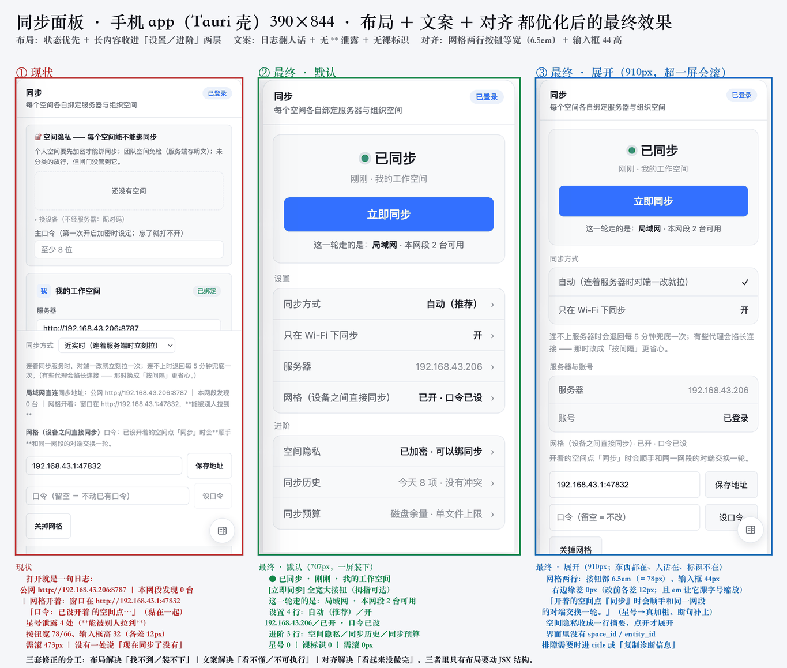

# 规格：同步面板的壳与密度

> 起草：macOS 侧｜**2026-09-28**｜需求见 [`2026-09-28-sync-panel-density-requirements.md`](2026-09-28-sync-panel-density-requirements.md)
> 依据：`_workspace/AI-NATIVE-DEV.md` §5.1（规格层）＋ 本仓 [`docs/specs/README.md`](README.md)（这一层的三条"不是什么"）
>
> ⚠️ **本层的第一优先级不是"多一份文档"，是"每条不变式都得有一条会红的判据"。**
> 本文件的 **§2 三条不变式，第四列全部是 `❌ 无`** ⇒ **按 `README.md` 的铁律，它们【现在还不在 `INVARIANTS.md` 里】**。
> 本文件的作用是**把"要立哪条判据、怎么证明它会红"写成可执行的前置条件**，
> 而不是让读者以为它们已经被守住了。**§3 给落地顺序。**

---

## 0. 字段口径（与 `INVARIANTS.md` 同形，便于将来机器迁移）

```text
id          INV-UI-sync-panel-<短名>   稳定标识；改口径不许改 id（改 id = 删除 + 新增）
口径        一句话；从判据的真源逐字引用，不在此重写
判据        scripts/verify-mobile-views.mjs（现有载体；或新增 check-*.mjs）[注入方式]
会红证据    ✅ 有（证明命令 + 期望非 0 退出码 + 账本 sha）／❌ 无（⇒ 按 README 铁律，该条还不该进 INVARIANTS.md）
```

**载体为什么是 `verify-mobile-views.mjs`**（而不是新写一个脚本）：
- 它**已经在**注册表里：`scripts/lib/gates.mjs:366` `{ id: "mobile-views", group: "mobile", … }`，
  入口 `pnpm test:mobile-views`，`pnpm verify` 与 CI 都跑得到 ⇒ **不需要新建第二份载体**；
- 它**已经在测 390×844 真 Chromium**（`verify-mobile-views.mjs:42` `{ name: "390x844", width: 390, height: 844 }`
  ＋ `:1404` `page.setViewport({ ...vp, deviceScaleFactor: 2, isMobile: true, hasTouch: true })`）；
- 它**已经有断言原语**：`:72` `const ok = (cond, msg) => { … pass++ / fail++ }`，`:1969` 汇总 `[结果] N 通过 / M 失败`
  ⇒ 加一条断言 = 加一次 `ok(...)` 调用；
- 它**有"基线只增不减"**（`gates.mjs:335` 一带）⇒ 新断言进基线后**只能加不能减**。

---

## 1. 本规格要解决的**一个口径问题**（比三条不变式更根本）

```text
isDesktopPlatform()  ≡  isTauri()  ≡  ("__TAURI_INTERNALS__" in window)      // src/lib/platform/index.ts:27-41
```
⇒ 它的语义是**「有没有 Rust 内核」**，**不是「是不是桌面操作系统」**
（源码注释逐字：「Tauri 的 Android/iOS 壳同样为真」）。
⇒ 所以同一块 `SyncPanel` 在三个壳里渲染出**三块不同的面板**（需求 §2 的读数：需滚 164 / 111 / 525）。

⚠️ **而现有移动端门禁测的是【Web 版】**：它设了 `isMobile: true`，但**没有注入 `__TAURI_INTERNALS__`**
⇒ **它看不见手机 app**。⇒ **这是本规格第一条不变式的直接理由。**

---

## 2. 不变式（`❌ 无` ＝ 按 README 铁律，**暂不进 `INVARIANTS.md`**）

| id | 口径（一句话） | 判据（要立的那条） | 会红证据 |
|---|---|---|---|
| **INV-UI-sync-panel-shell-matrix** | **凡"窄屏／移动端"的断言，必须声明它在哪个壳里；Web ／ Tauri 桌面 ／ Tauri 移动是三个对象，不许用其中一个的读数代表另外两个** | `scripts/verify-mobile-views.mjs` ⇒ **给现有断言加"壳"这一维**：对每个视口各跑两遍（无壳 ＝ Web ／ 注入 `__TAURI_INTERNALS__` ＝ 移动壳），**两遍的断言集合必须分别通过** | **❌ 无**（要立。**怎么证明它会红**：把 Tauri 注入那一路删掉 ⇒ 只跑 Web ⇒ 断言必须红，因为"移动壳这一路根本没跑"） |
| **INV-UI-sync-panel-persistent-chrome** | **常驻 chrome（`.sync-foot` 这类 `position:sticky` 的段）里不许有需要阅读与填写的表单** —— 读数行可以有，设置控件不行 | `scripts/verify-mobile-views.mjs` ⇒ 断言：**Tauri 移动壳**下 `.sync-foot` 内**可见**的 `input, textarea, select` 数量为 0（⚠️ **必须是「可见」**：`display:none` 不摘 DOM ⇒ 数 `querySelectorAll` 会假绿。判据用 `el.getBoundingClientRect().height > 0 && getComputedStyle(el).display !== "none"`；按钮另按「是否主操作」单独列） | **❌ 无**（要立。**怎么证明它会红**：实测 `.sync-foot` 里 `input/textarea/select` ＝ **Web 4 ／ app 手机 3 ／ app 桌面 3** ⇒ **三个对象上现在都红**，它同时是"当前缺陷的证据"与"改完的回归守卫"） |
| **INV-UI-sync-panel-desktop-no-scroll** | **Tauri 桌面壳、视口 ≥ 1280×800 时，同步面板不该滚动**（`scrollHeight ≤ clientHeight`） | `scripts/verify-mobile-views.mjs` ⇒ 新增桌面视口那一路 ＋ 一条 `scrollHeight ≤ clientHeight` 断言 | **❌ 无**（要立。**怎么证明它会红**：打开"局域网直连 ＋ 网格"两段 ⇒ 实测 **711 > 606**（两次实测分别 111px 与 92px）⇒ **现在就是红的**；关掉 P2P 后 `0`，可作对照） |

---

## 3. 落地顺序（**先让判据可跑，再进 `INVARIANTS.md`**）

> 这是 `README.md` 的收录条件：① 能指到会红的判据 ② 有"看过它红"的证据 ③ 证据能原地重做。

```text
第 1 步  给 verify-mobile-views.mjs 加【壳】这一维（注入 __TAURI_INTERNALS__ 的开关）
         ⇒ 这是另外两条的前提：不区分壳，另外两条测的都不是目标对象
第 2 步  加 INV-UI-sync-panel-persistent-chrome 的断言
         ⇒ 它现在是红的 ⇒ 正好满足"看过它红"（②）
         ⇒ 而它的"再注入"口子就是【往 .sync-foot 里塞一个 input】（③）
第 3 步  加 INV-UI-sync-panel-desktop-no-scroll 的断言（桌面视口）
         ⇒ 同样是先红（711 > 606）
第 4 步  三条都拿到"看过它红"的证据（写进 `_workspace/mutation-evidence.json` 的 `_repo_mutations`）
         ⇒ 才把这三行搬进 `INVARIANTS.md`
第 5 步  再谈改动（把 P2P 的设置从吸底条搬走）—— 那时第 2、3 条会自动由红转绿
```

### 3.1 落地现状（2026-09-28 晚，macOS 侧记）

> 本节只记**进度与依赖**，不重复 §2 的口径。分界线是：**判据先落地（A–C），UI 改动后落地（D）。**

```text
A 先合"载体"（都不动 UI；前三笔各自"读数逐字不变"或有基线兜着）
  A1 feat/copy-discipline-gate           1c47802  ✅ 文案判据载体；自身不红（与基线持平）⇒ 可直接合
  A2 fix/mobile-views-false-pass         040c8dc  ✅ 修 3 处 `x?.a === x?.b` 假绿；门禁读数逐字不变 ⇒ 可直接合
  A3 fix/sync-mesh-alignment             bfa33a5  ✅ 对齐（按钮 min-width 6.5em ＋ 输入框 min-height 44）
                                                   ＋ 把命中区判据从"只量按钮"扩到含 input ⇒ 可直接合
  A4 spec/sync-panel-density             56d15ab  规格 §4.5 ＋ 效果图（⚠️ 本分支第 2 笔 700f993 还没进 dev）
  A5 spec/user-facing-copy               b0f8a7c  文案规格 ＋ 效果图
  A6 test/sync-panel-density-assertions  90a163b  ⚠️ **有 3 条红** ⇒ 需先定过渡口径（甲直接红／乙已知红基线／
                                                   丙只 tauri 档）才能合；倾向乙（仓内已有两处同形先例）

B 解阻塞：**补 tauri 桩**（这是 C 与 D2 验收的前提）
  现状：`APP_SHELL=tauri` 整档在 `verify-mobile-views.mjs:1711` 抛异常 ——
        `.database-view` 建不出、`.mobile-right-toggle` 找不到 ⇒ **手机一路跑不完 ⇒ 桌面一路根本没开始**。
  我这边调用记录器实测「未知且返回 null」的三条：`team_online` ／ `team_presence_beat` ／ `sync_stream_start`
  验收：`APP_SHELL=tauri node scripts/verify-mobile-views.mjs` **整档跑完**（不是"跑出一部分"）。

C `INVARIANTS.md` 收录（规格第 4 步）
  材料：`shell-matrix` 的会红证据（删掉 tauri 注入那一路 ⇒ 红）＋
        `persistent-chrome` 的三对象读数（Web 4 ／ app 手机 3 ／ app 桌面 3）
  ⚠️ `desktop-no-scroll` 的 **tauri 档门禁读数**还缺（桌面读数目前来自单独探针）⇒ **等 B**。

D 动 UI（规格第 5 步）—— 功能落地的主体
  D1 布局：把 `.sync-foot`（`SyncPanel.tsx:1217-1463`，247 行）里的常驻设置搬出吸底条。
     现状实测：foot 里【可见】表单 = **Web 4 ／ app 手机 3 ／ app 桌面 3**；
     其中 `sync-mesh`（网格设置）带**两个 input**（监听地址 `:1276` ／ 口令 `:1288`），是主要来源。
     验收：`persistent-chrome` 转绿（可见表单 → 0 或"foot 不再存在"）。
  D2 桌面不滚：D1 之后通常自然好转（现 tauri 桌面 **672 / 606 ⇒ 要滚 66px**）；
     若仍 >0 再收一档。验收：`desktop-no-scroll` 转绿。
  D3 文案：10 处裸标识（文案规格 §4）＋ 2 处星号 ＋ 3 处相邻分隔。
     验收：`check-copy-discipline` 的 C1 基线**逐条减少**、C2 的 `inlineMd` 覆盖**上升**。
  D4 对齐 ✅ **已做**（A3）。
  D5 状态置顶 ＋「这一轮走的是」：**读数现成** —— `LanStatus.kind`（"lan"/"configured"/""）
     ＋ `.peers`（N 台，注释逐字：「与状态行里那个"N 台"是同一个数」）⇒ **前端可做**。
     ⚠️ 但**「刚刚」这个时间没有现成读数**：`SyncProfile` 只有 `last_pushed_seq` / `last_pulled_seq`
        （**序号，不是时间**）⇒ 要么先**不显示时间**（只显示状态），要么 Rust 侧新加一个 `last_sync_at`。
        ⇒ **这一条要先定，否则 hero 里那个"刚刚"是编的。**

E 分工与边界
  · macOS（我）：判据、规格、CSS 对齐、读数普查 —— 已交（A1/A3/A4/A5/A6 ＋ B 的记录器结论）
  · `SyncPanel.tsx` 的 JSX 改动（D1／D5）属 **windows 写域** ⇒ 由它做，或 owner 明确授权我做
  · B 的桩改动也在 windows 写域（`verify-mobile-views.mjs` 它有在动）⇒
    ⚠️ **别两边同时改 applyShell**（我先前已发信说明，避免同时改同一函数）
```

⚠️ **第 5 步在最后，是有意的**：需求 §3.4 说"目标不是这次调好看，是把好看变成会红的断言"。
**先有断言，再有改动** —— 否则改完之后没人能证明它没退回去。

---

## 4. 与需求/方案的分工（防止三份互相抄）

| 文件 | 放什么 | 不放什么 |
|---|---|---|
| `docs/plans/2026-09-27-sync-panel-mobile-density.md` | **过程**：F1–F12 勘察读数、四个选项、边界、推荐 | —— |
| `2026-09-28-sync-panel-density-requirements.md` | **需求**：用户诉求、三对象读数、要什么/不要什么/边界 | 判据与不变式 |
| **本文件** | **规格**：不变式 ＋ 判据指针 ＋ 会红证据现状 ＋ 落地顺序 | 三对象读数（引用需求 §2）、选项权衡（引用方案 §3） |

---

## 4.5 ⭐ 预期效果（模拟，2026-09-28 补）与它暴露的一个坑



> 图源：`docs/media/sync-panel/final-layout-and-copy.png`（真 Chromium 渲染，390×844 手机 app 壳）
> ⚠️ **图里的数据是 mock**（"刚刚"／"今天 8 项"／"2 台可用"都是占位）——**布局、字号、高度是真的**，业务读数不是。
> ⚠️ 三块面板里的**结构 / 文案 / 尺寸**都是按本规格与《用户可见文案》规格**重排的提案**，不是已落地代码。


**模拟方式**：**真 CSS 注入**（`display:none` 掉 `.sync-foot .sync-att.sync-mesh`），不改源码。
手机 app（Tauri 壳）390×844：

| 指标 | 现状 | 改后（模拟） |
|---|---|---|
| 需滚 | **505px** | **308px** |
| `.sync-foot` 高 | **352px**（占视口 42%） | **155px**（占视口 18%） |
| `.sync-mesh` | 195px | **0px** |
| foot 里的表单控件（`querySelectorAll`） | 3 个 | **3 个** ← ⚠️ |

⚠️ **⚠️ 那最后一行是本节的重点**：把 `.sync-mesh` 设成 `display:none` 之后，
**`querySelectorAll("input,textarea,select")` 数出来【还是 3 个】** —— 因为 `display:none`
**不把节点从 DOM 里摘掉**。
⇒ **⇒ 所以 §2 那条断言如果写成 `querySelectorAll(...).length === 0`，它会【假绿】**：
   面板看起来搬干净了，判据说"通过"，而 DOM 里那三个控件还在（随时可能被别的 CSS 放回来）。
⇒ **⇒ 断言必须数「可见」的控件**（`getBoundingClientRect().height > 0` ＋ `display !== "none"`）。
   **这一条是本次模拟【唯一】的新增发现，已回写进 §2 那一行。**

⚠️ 另外两处**如实说**：
- 我在模拟里给 `.sync-lan` 加了 `padding: 4px`，结果它从 **39px 涨到 47px**（我个人为的偏好反而让它更大）
  ⇒ 说明"顺手加点间距"这类改动**必须由断言兜住**，不能凭手感。
- 模拟**只搬走了网格设置**，**没有动** `.space-privacy`（269px，加密相关 ⇒ §12 要先问）
  与空间卡（586px）。⇒ 所以 308px 的滚动**仍在**；要消掉它需要第 5 步（需求 §3.3 的分层）。

## 5. 本文件**故意不含**的

- ❌ **三条不变式的具体像素阈值**（如"常驻 ≤150px"）—— 阈值只该活在断言里（需求 §4 第一条）。
- ❌ **P2P 后续几片（甲-2 接待窗口、B 片配对）的形态** —— 它们还没落地（需求 §5.3）；
  ⚠️ 但 `INV-UI-sync-panel-persistent-chrome` 这条**对它们同样适用**，届时直接复用。
- ❌ **"乱"的美学判断** —— 不可判定，需求 §5.1 已如实排除。
