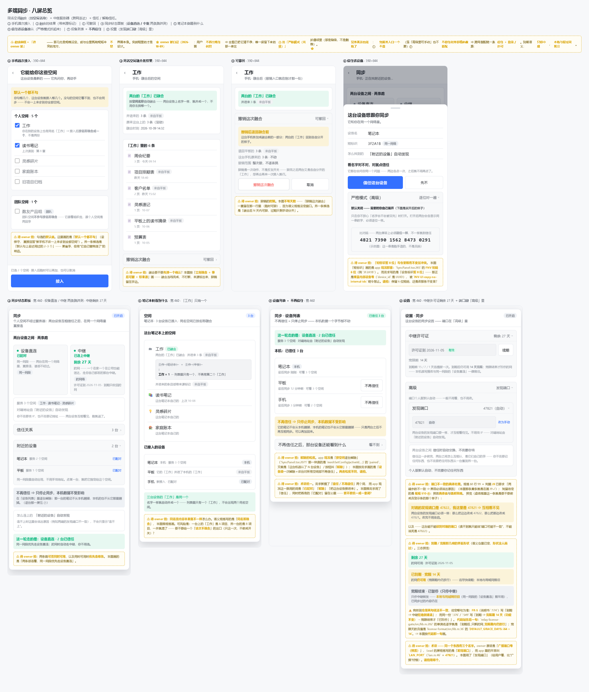

# 规格：多端同步语义 —— 同名个人空间按名融合 ＋ 中继送达

> 起草：**2026-10-09**｜本层规矩见 [`README.md`](README.md)（**没有判据兜着的口径不许当契约引**）
> ⇒ 本文 §9 每条口径都给**可执行判据**；**今天定不了的一律进 §10「待定」，并写清为什么现在定不了**。
> ⭐ **owner 口径三条（逐字，不许改写）**：
> ①「个人版难道不应该立刻多个同名空间相互融合吗？」
> ②「多个个人空间相互融合，**不含团队空间**」
> ③「**用空间名称融合，而不是空间id**」

*图注：`all.png`（**2200×2582**）· ★ 总览（八屏）—— 高保真效果图（示意；图里虚线黄框＝待拍）*

## 0. 一句话

**语义一层、送达两条。**「谁跟谁同步、同名怎么并」**与怎么送达无关**；中继只是送达方式之一。

## 1. 现状事实（逐字引用；代码事实给 `file:line`）

| # | 事实（逐字） | 出处 |
|---|---|---|
| F1 | 「**空间隔离**：每个空间（`space_id`）绑定自己的变更集；`/push` `/pull` 均带 `space_id`，不会串空间」 | [`../SYNC.md`](../SYNC.md):106 |
| F2 | 「每个空间是**独立**的页面树 ＋ 标签 ＋ 数据库 ＋ 关系图 ＋ 回收站 ＋ **同步/加密**」 | [`../plans/2026-08-22-multi-workspace-plan.md`](../plans/2026-08-22-multi-workspace-plan.md):5 |
| F3 | 「`attr_defs` 变为**每空间一份**——『**同名属性跨库语义一致**』的哲学在物理隔离下**不再成立**」 | [`../plans/2026-08-22-per-workspace-storage-plan.md`](../plans/2026-08-22-per-workspace-storage-plan.md):57 |
| F4 | 「**空间绑定**：客户端工作空间 id ↔ 服务端 `space_id` 映射（每空间库存）；**拉取只请求该 space**」 | [`../plans/2026-08-30-team-edition-account-space-plan.md`](../plans/2026-08-30-team-edition-account-space-plan.md):54 |
| F5 | 目标＝「跨机器多端同步（Windows ⇄ Mac，服务器放 Mac）」；2026-09-15 **已实测通过**（两端 `pass 6 / fail 0 / peerSeen true / bidirectional true`）；唯一缺口＝「**真客户端 GUI 肉眼确认**」未做 | [`../sync-multidevice-test.md`](../sync-multidevice-test.md):17、`:29-30`、`:44` |
| F6 | 实测（今天，Windows 侧）：`mesh_paired_devices.space_id` **不是 UUID**（像暗号）；`sync_history.ws_id` **是 UUID**；发现走 **UDP 固定口 47821** | 见 F7、`src-tauri/src/lan.rs:46` |
| F7 | 个人空间 `space_id` 是**空串** ⇒ 直连对的是用户填的「配对暗号」`mesh_room`（原话：「个人空间没有 space_id」） | `src-tauri/src/sync.rs:3640`、`:3684` |
| F8 | 公告 `LanAnnounce` 只有 `device_id / device_name / hub_base / hub_spaces / fp` ⇒ **不带空间名** | `src-tauri/src/lan.rs:65-84` |
| F9 | 新装设备默认空间 id 是**常量 `'default'`**、名 `'默认空间'`；新建空间才是 `uuid v4` ⇒ **id 撞车是常态，名字才是可读身份** | `src-tauri/src/db.rs:286`、`src-tauri/src/workspaces.rs:335` |
| F10 | `workspaces.name` **无 UNIQUE**（同名合法）；`kind` ∈ `''`（未分类，**默认**）／`'personal'`／`'team'` | `src-tauri/src/db.rs:395-412` |
| F11 | 每空间**一个独立 SQLite 库**（库内：`pages`／`changes`（`seq INTEGER PRIMARY KEY AUTOINCREMENT`）／`attachments`／`page_versions`／`page_fts`(fts5)／`backlinks` …） | [`../plans/2026-08-22-multi-workspace-plan.md`](../plans/2026-08-22-multi-workspace-plan.md):3、`db.rs:817-1000` |
| F12 | 附件是**内容寻址 SHA-256**（「hash 仍按**明文**算」），且**按空间分目录** | `src-tauri/src/attachments.rs:20`、`:83` |
| F13 | 最近前身＝`export_workspace`／`import_workspace`；导入**总是新建一个空间**，**不合并** | `src-tauri/src/workspace_io.rs:399`、`:451` |
| F14 | 团队版角色：`viewer < editor < admin < owner`，未知角色**按最低档**（deny-by-default） | [`2026-10-01-enterprise-im-requirements.md`](2026-10-01-enterprise-im-requirements.md):56 |

## 2. 融合的触发条件（**四条全中才融合**；缺一即不融合）

*图注：`screen1.png`（**780×1688**）· ① 手机首次接入「它能给你这些空间」勾选（默认一个都不勾；团队空间显式标注**不参与按名称融合**）（对应 C4「新设备首次接入」＋ §8「它能看你哪几个空间」）—— 高保真效果图（示意；图里虚线黄框＝待拍）*

| # | 条件 | 不中时的行为 |
|---|---|---|
| C1 | **同名** —— 按**名字**判等（§3 归一后），⛔ **不看 id** | 各留各的，**不并** |
| C2 | **同一个人**（同账号／同许可） | 不并（否则等于把别人的库并进来） |
| C3 | **两边都必须「个人空间」** | 一边是团队空间 ⇒ **不融合**，只显示一句提示 |
| C4 | **新设备首次接入**（该设备与该空间此前没有任何融合记录） | 重复接入走 §4 幂等 |

⭐ owner 口径 ②在此落地：**团队空间一律不参与融合**（团队版走服务端成员/角色那条路，F14）。

## 3. 字符串归一规则（**归一后同名才算同名**）

按此顺序，一条不改：① 去掉不可见字符（零宽／软连字符／BOM）→ ② `trim` 首尾空白（**含全角空格 U+3000**）
→ ③ 全角↔半角折半（`NFKC`）→ ④ 大小写折叠 → ⑤ 内部连续空白折成**一个**半角空格。
- 归一**只用于判等**，⛔ **不许改写入库的名字**（用户写的是「默认空间」，库里就得是它）。
- 英文/数字/全角：`ＡＢＣ` ≡ `abc`；`默认空间 ` ≡ `默认空间`。⚠️ 简繁/异体**不做**等价（§10-③）。

## 4. 幂等（同一对设备重复接入**不得重复并入**）

- 一次融合 = **一条记录**：形状参考「目标空间库 `changes` **恰 +1**」（判据见 §9-J3）。
- 重复接入同一对设备 ⇒ `changes` **不再增长**，且**不再产生第二份内容**（页面数也不许涨）。
- 记的是「**融合事实**」（谁＋哪台＋何时），⛔ 不是「每次接入都记一笔」。

## 5. 可撤 ＋ 标来源

*图注：`screen2.png`（**780×1688**）· ② 同名空间融合的**结果**呈现（含「来自平板」来源标记、融合时刻、「工作」里的 6 条）—— 高保真效果图（示意；图里虚线黄框＝待拍）*

*图注：`screen3.png`（**780×1688**）· ③ 融合后可撤回入口（展开态：「撤销后退回融合前」「整次撤，不逐条挑」）—— 对应本节「一次操作退回融合前」—— 高保真效果图（示意；图里虚线黄框＝待拍）*

- **标来源**：每个并入条目可看出「**来自哪台**」（设备名／`device_id` ＋ 原空间名）。
- **可撤**：一次操作退回**融合前**；退回后 `changes`、页面数、附件行数都回到基线（判据 §9-J5）。
- 落地办法沿用现成那条：融合前先留**可核快照**（同 F13 的导出路径，明文库契约）。

## 6. 落地代价（**如实写**：融合 = 真合并两个库）

| # | 代价 | 现状根据 | 处置口径（今天能定的） |
|---|---|---|---|
| 1 | **页面 id 可能撞车** | 页面 id 是 `uuid v4`（`commands.rs:150`）⇒ 概率低但**不是零**（导入两次同一份包就会撞） | 撞车 ⇒ 并入侧**重新分配 id**，并同步改所有引用它的行（`parent_id`／`page_props`／`backlinks`／`page_tags`／`db_views.db_page_id`） |
| 2 | **`changes` 序列号重排** | `seq INTEGER PRIMARY KEY AUTOINCREMENT`（F11），是**每库各自**的 | 并入的变更**不沿用原 seq**；目标库按自己的 `seq` 追加（F1：push/pull 都带 `space_id`，跨空间不串） |
| 3 | **附件按 hash「相对安全」** | hash 按**明文**算 ⇒ 跨空间可去重；但**按空间分目录**（F12） | **不等于可直接引用**：要把字节落到目标空间目录（或建立该空间可见的那一份），并补 `attachments` 行 |
| 4 | **回收站／历史** | 回收站＝`pages.deleted_at`；另有 `page_versions`／`page_fts`(fts5)／`page_crdt` | 回收站条目**照原样并入**（不许悄悄复活）；`page_fts` 等派生物**重建**，⛔ 不搬原索引 |

## 7. 送达两条（**同一语义**；中继只是其中一条）

*图注：`screen4.png`（**920×2020**）· ④ 同步状态面板 —— **设备直连／中继两条路并列**（含「服务 3 个空间」、附近的设备、信任关系 3 台、绿条「这一轮走的是：设备直连 · 2 台已信任」）—— 高保真效果图（示意；图里虚线黄框＝待拍）*

| 送达 | 形态 | 今天的实测状态 |
|---|---|---|
| **A 设备直连** | 同网段，**UDP 47821** 发现（F6）⇒ 直连同步 | ⛔ **仍断在「发现→同步」**：面板「读错了」⇒「附近设备」不渲染 ⇒ **配对入口进不去**（`src-tauri/src/lan_state.rs:412-420`） |
| **B 中继／经服务器** | 跨网，走服务器 | ✅ 2026-09-15 **已实测通过**（F5）；⚠️ 而正式中继组件 `repos/shuyonote-relay` **今天还没接入客户端**（依据＝该仓 `README.md` 的状态段；⛔ 本文不复述其正文）⇒ 今天走的是自建同步服务端那条 |

> ⚠️ **订正（lead 2026-10-09，撤回一句不精确的话）**：先前那句「**中继那条已经验通过**」**不精确，撤回** —— 实测通过的是 ⭐ **自建同步服务端**那条（含公网隧道 ✓），⛔ **不是中继组件** ✗（依据＝`repos/shuyonote-relay` 的 `README.md` 状态段 ⇒ 客户端今天连不上它）。本规格按订正后的口径写。

- **降级规则**：中继不可达 ⇒ **先试设备直连**；两条都不通 ⇒ ⛔ **不许静默不同步**：必须能说出**走的是哪条路、或两条为什么都没走成**。
- **中继下的身份／成员语义**：团队版是 `viewer<editor<admin<owner`（F14，服务端 `require_space` 判定）；
  ⭐ **个人空间融合不适用团队**（§2-C3）—— 个人侧融合的判据只有名字＋同一个人。
- **「服务 N 个空间」必须能读出来**：现成口径＝窗口服务多个空间时，请求**必须带 `?space_id=`**，
  说不清要哪个**直接拒**（`src-tauri/src/mesh.rs:1267`、`:914`）⇒ 状态面板要能读出 N 与是哪几个。
- ⭐ 中继那条路还要能看见**许可证剩余天数**（owner 2026-10-09 点名）⇒ 见本节末的〈**中继许可证与剩余天数**〉（含"这个读数从哪来"的核查）。

### 中继许可证与剩余天数（**owner 2026-10-09 点名要显示**）

*图注：`screen8.png`（**920×2760**）· ⑧ 中继许可证与剩余天数（本节①②③的界面形状：剩余 27 天／许可证到 2026-11-05／宽限期 14 天／高级里的发现端口 47821＋「改为手动」／三态预览：剩余→宽限→已暂停「只停中继」）—— 高保真效果图（示意；图里虚线黄框＝待拍）*

> ⭐ **owner 逐字**：「**显示剩余多少天；严格模式默认关闭**」（后半句落在 §8-bis ✓、判据 J20）

**① 显示什么**：⭐「**剩余 N 天**」＋ ⭐ **到期日**（例：剩余 27 天／许可证到 2026-11-05）。⛔ 不许只有一个"已连上中继"，看不出还剩多久。

**② 这个读数从哪来（**已定**：源就是许可证自己的 `exp`）**
- ⭐ **实现处与唯一真相源 —— 只给路径与节号，⛔ 不复述其正文**：
  `repos/shuyonote-relay/crates/license-format/`（实现处） ／ `repos/shuyonote-relay/docs/specs/2026-10-02-license-format-spec.md` **§3／§4／§5**（字段表 ／ 时间轴 ／ 谁在哪验）。
- 字段名（只写形状，不引正文）：`exp`（失效时刻）／`nbf`（生效）／`grace_days`（宽限天数）。
- ⭐ **「剩余 N 天」＝ 从 `exp` 算**（该实现已有；中继那一格另有算法，见下条）。
- ⚠️ **宽限期必须一并写清**：宽限期**默认 14 天** ⇒ 界面形状例：**「剩余 0 天 · 宽限 14 天」**。
- ⚠️ **与中继那一格不是同一个数**：中继状态页那一格算的是**到"跨网彻底不可用"为止、把宽限也算进去**的天数
  （路径：`repos/shuyonote-relay/crates/relay-server/src/lib.rs:342-348`）⇒ 与"到 `exp` 的天数"**不相等**
  ⇒ 必须**显式选一个口径**（§10-⑰，**两种口径的用户可见文案都要写出来**）。
- ⚠️ **过期后会算出负数**：那一格的取整是**向下取整**（同一路径）⇒ 过期后是 **−1 天** ⇒ 由 J19 挡（见 J19 反例）。

⚠️ **今天客户端还拿不到这个读数（如实）**：`ShuyoNote/` 全仓 `license-format` / `SHUYO-LIC` / `SHUYO-TOK` **零命中**
（无依赖、无调用点）；中继那边有这个读数却**只绑回环**（非回环地址**启动即拒**）⇒ **用户看不见**。
⇒ ⭐ **来源已定、接线待实现**（⛔ 不是"已有"）；接线后读不到时**不得显示假数**（J22）。

**③ 边界**：⭐ **时钟容差 ±10 分钟**（路径与节号：`repos/shuyonote-relay/crates/license-format/` ／ 真相源 **§4**）⇒「时钟不准怎么办」**已定**；
⭐ ⛔ **不许显示负数**（应显示「**已到期**」）；「到期当天算 0 还是 1」⇒ **§10-⑱**。

**④ 到期后怎么样 —— 产品口径，⭐ **owner 2026-10-09 已拍****
- ⭐ 到期 ⭐ **只停中继服务（＝只收回跨网）**；⭐ **本地功能与本地数据不受影响**；⭐ **局域网／设备直连能力照旧** ✓；⭐ ⛔ **任何一态都不得删除、加密、隐藏或改写用户数据**；⭐ **有宽限期，默认 14 天**。
- ⚠️ ⭐ **这五条今天「出处待补」**：产品仓里**没有**它们的产品侧出处（`ShuyoNote/` 内检索无对应文档）
  ⇒ ⛔ **不拿商业组件仓的正文当产品侧出处**（仓界）⇒ 已列 **§10-⑳**（要在产品仓补一处出处）。
- ⭐ **曾经的待拍点「到期后设备直连还能不能用」已结案**（owner 2026-10-09 拍：**照旧可用** ⇒ §10-⑲ 结案）。

⚠️ **仓界（如实说）**：本节只引**路径与节号**，⛔ **不复述商业组件仓的任何正文句子** ✗（仓界口径：本仓 AGPL ／ 那份专有 ⇒ **只索引、不搬运**；跨仓引用**不作可点链接**，以免文档链跨出本仓）。

## 8. 权限模型（**owner 最新需求**）＋ 用户到底要填什么

*图注：`screen6.png`（**780×1688**）· ⑥ 信任该设备弹层（设备名 ＋ 短标识 ⇒ J21；「严格模式（高级）」默认关、展开才逐位核对 ⇒ J17／J20）—— 高保真效果图（示意；图里虚线黄框＝待拍）*

> ⭐ **owner 逐字（2026-10-09）**：
> 「个人版同步需要用户填的东西：1、**广播端口号（预置）**；2、**同步密码**；3、**第一次连接，需要用户点一下"信任该设备"**；
> ⭐ **随时可以不信任该设备接触（解除）同步关系**。这样合适吗？」
> ⭐ **本节的默认取值** ＝ lead 的判断（已回给 owner）；⚠️ 与 owner 原话**有落差**的点标「**待 owner 拍**」（见本节末）。

**一句话：第一公民 ＝ 信任。** 用户只需理解两件事 —— ①「信任这台设备」②「它能看你哪几个空间」。

| 主题 | 默认取值（本规格） | 理由（要写进文档的那句） |
|---|---|---|
| **端口** | 预置 ⇒ **默认不显示**，只在「高级」里可改；被占时**自动退避**；广播要报**真实端口** | 端口是网络层的细节，⛔ 不是用户的决定 |
| ⭐ **必须可诊断** | 两端端口／发现参数不一致时，界面**必须说出原因** ✗ ⇒ ⛔ 不许只显示"连不上" | 今天正是「**配对成、端口通、用户什么都看不到**」—— 这就是代价 |
| **同步密码** | ⭐ **用户永远不输入**（**owner 2026-10-09 已拍** ✓）：默认**自动派生 ＋ 自动交换**；⚠️ **连"高级里可手动"也不要** ✗。有账号/许可 ⇒ 自动；**跨网首配** ⇒ 只余**登录/许可**一条（⛔ **扫码也不要**，同日已拍） | 密码是**网络层的门**，而用户要做的决定是「信不信任这台设备」。⚠️ 让人手输长密码 ⇒ **错一位就连不上且无提示**（与今天那个 bug 同形）。⛔ 投放码已按 §8-bis-③ **整个去掉**。⭐ **界面上任何"窗口口令／密码"的暴露面 ⇒ ⛔ 用户永远不需要看到**（今天的反例：`SyncPanel.tsx:2096` 要用户**手交**"地址 ＋ 窗口口令"）= J14 的反例之一 |
| ⭐ **解除信任** | **只停止同步**；本地数据**一个字节都不动** ⇒ ⭐ **必须写在按钮旁边** | 解除关系 ≠ 删数据。⚠️ 今天那句**不在**（`SyncPanel.tsx:2073-2076` 只说了"只影响那一台"） |
| ⭐ **状态可读** | 「这一轮走的是：**设备直连 · N 台已信任**」＋「**服务 N 个空间**」＋「**本机：已信任 N 台**」 | 说不出来就是文档没写成；⛔ 不许停在"正在同步…" |
| ⭐ **层次** | **信任＝设备级** ／ **融合＝空间级** ⇒「信任这台设备」⇒ 它能看**你勾选的那几个空间** ⇒ ⭐ **同名融合只在"被信任 ＋ 被勾选"的空间里发生** | 与 §2 接上：C2／C3 之前先过信任这一关 |

⚠️ **现状与本节取值的落差（如实，别当成已实现）**：今天的「认哪些设备」是**每空间一行**（`mesh_paired_devices` 的 `PRIMARY KEY (space_id, device_id)`，`db.rs:420-426`）⇒ ⭐ **「设备级信任」今天是新增形状**；解除动作**已有实现**（`device_unpair`：删那一行 ＋ 从在跑的门上摘卡 ＋ 清本机那份秘密，`sync.rs:3316-3322`）⚠️ 但**「本地数据零变化」今天没有判据钉着**（⇒ J10 待立）；今天的接入要**手交**「接线（地址 ＋ 窗口口令）」（`SyncPanel.tsx:2096`）⇒ J12／J13 正是要消灭这一步。

*图注：`screen7.png`（**920×1800**）· ⑦ 设备列表 · **不再信任**（「本机：已信任 3 台」＋「不再信任 ⇒ 只停止同步，本机数据不受影响」）—— 对应本节「解除信任」＋ J10「本地数据零变化」／J11「对方不得再拉到」—— 高保真效果图（示意；图里虚线黄框＝待拍）*

⚠️ **owner 三条新决策（2026-10-09）**：① **到期只停中继服务** ✓（＝只收回跨网；**本地与局域网／设备直连照旧** ⇒ 见 §7④）；② ⛔ **扫码也不要** ✗（跨网首配只余**登录/许可**；§10-⑯ 结案）；③ ⭐ **密码也不要用户输入** ✗（含"高级里可手动"⇒ 上面那行已写死）。⭐ **端口**已给默认值（**§10-B ㉙：不要求用户填、只读显示**）⇒ 本节**不再挂待拍**；⭐ **归 owner 的**＝§10-④（融合后留谁的 id／名字）＋ **§10-A 栏**（㉒㉔㉖㉚）⇒ **待拍清单一律以 §10 为准**。

## 8-bis. 去码化（**用户面不再出现任何「码」**）

> ⭐ **owner 逐字（2026-10-09）**：「**不要投放码、暗号、比对码可以吗？**」
> ⭐ **答复（lead，已回 owner）**：**三个都能去** ✓，但必须换上一个东西 ⇒ ⭐ **信任时的一次握手**
> （⭐ 两端各显示**对方的名字** ＋ 各点一下 ✓）＝ 就是 owner 最早说的「第一次连接点一下信任该设备」。

| # | 码（今天的样子） | 它原来解决什么 | 现在谁替代 |
|---|---|---|---|
| ① | **比对码**：**20 位十进制、4 位一组**（`pairing.rs:293`），熵下限 **60 bit**（`pairing.rs:279`） | **防「换码」**——「两端各算一个比对码、由人核对一致」（`pairing.rs:277`） | ⭐ **默认关闭**（**owner 2026-10-09 已拍** ✓）⇒ **两端各显示对方「设备名 ＋ 短标识」**，看一眼就能对上（个人版是**自己的两台设备**，名字是用户自己起的）。⚠️ ⛔ **不许删掉那条实现** ⇒ 降级为 ⭐ **「严格模式」**（高级里的开关，**用户主动展开**才逐位核对）—— 理由是**今天实测它真的挡下过一次配错** |
| ② | **暗号**（`mesh_room`；个人空间今天**用户手输**，F7） | 网格**按暗号认空间**：`hub_spaces` 就是那个匹配键，`serves_space` 按**去空白字面量相等**判（`lan.rs:201-214`） | ⭐ 用户不再填 ⇒ ⭐ **信任时自动生成 ＋ 握手时交换**。⚠️ **交换方式必须写清**（两端要拿到同一个值）；**若无法直连**（跨网首配）⇒ 走**中继**（靠**登录/许可**对上号）—— ⛔ ⭐ **扫码也不要**（**owner 2026-10-09 已拍** ✗，§10-⑯ 结案）；但用户看到的仍是「**信任这台设备**」，⛔ 不是"抄一段码" |
| ③ | **投放码**：今天就是那段 JSON 文本，**含窗口口令**（`SyncPanel.tsx:350`；lead 口径 171 字符，⚠️ 仓内未复核） | 把「窗口端口 ＋ 绑定写法 ＋ 窗口口令」搬过网（`2026-09-29-personal-edition-tasks.md:67`） | ⭐ **整个去掉** ⇒ 三条理由：① 它**把窗口口令带在明文里**（`SyncPanel.tsx:350`，owner 截图里就有过）；② 局域网**自动发现已经报地址**（`LanAnnounce.hub_base`，F8）⇒ 常规场景**根本不需要它**；③ 跨网由**中继**承担 ⇒ 它只剩「发现失败时的兜底」，而那个兜底**应该是一句解释**（引 J9），⛔ 不是让用户手抄一段码 |

⚠️ **两条必须一起改的（如实说，别漏）**
- ⛔ **不许把"去掉比对码"写成"删掉实现"** ✗ —— 是**降级为严格模式**（今天它真挡下过一次配错）。
- ⭐ **owner 已拍（2026-10-09）：严格模式默认关闭** ✓，且 ⭐ **不自动展开** ✗（不再建议"判不出时自动展开"—— 与"默认关"冲突，且属过度设计）。
- ⚠️ **会碰到既有门禁**：`check-pairing-requires-proof`（`gates.mjs:333`）钉着「配对必须有人核对过：码长下限未被缩短／比对码真的比／采纳前先核对／拒绝路不继续」⇒ 默认不显示比对码之后，这条判据要**改判「人核对」的新证据**，否则要么红、要么形同虚设 ⇒ ⭐ **新形状（可直接立的判据，见 J21）＝「信任前必须展示对方的身份（设备名 ＋ 短标识）」＋ 严格模式下比对码逐位一致**（§10-⑭ 仍是那条待接线）。
- ⚠️ **今天的形状恰好是反例**：面板逐字「**一次只装这一侧**」（`sync.rs:2646`）—— 一次只装一侧 ⇒ J16 要消灭的就是它。

## 9. 判据表（每条给**命令或可观察读数**）

*图注：`screen5.png`（**920×1810**）· ⑤ 笔记本侧看到什么（「已融合·并进来 3 条 来自平板」「工作 × 1」＋ 已接入的设备）—— 判据 J1／J2／J5 的**观察面**之一 —— 高保真效果图（示意；图里虚线黄框＝待拍）*

> ⚠️ **诚实版**：下面 **22 条（J1–J22）今天一条都还没有**对应的 `check-*.mjs`（＝本层的「会红证据」现为 `❌ 无`）。
> 它们的作用是**把"要立哪条判据、怎么才算红"先写成可执行的前置条件**，⛔ 不是"已经守住了"。

| id | 判据 | 命令／读数 | 期望 |
|---|---|---|---|
| **J1** | 新设备接入后，同名个人空间**不得**出现两份 | 空间列表（`meta.workspaces` 里 `deleted_at IS NULL` 的行）＋ `spaces/` 目录下的库数 | ✗ 关键「同名」项只有一份 |
| **J2** | 不同名**不得**自动合并 | 与 J1 同一条命令；两个不同名空间接入 | 仍是两份，且**未**相互并入 |
| **J3** | 融合**幂等**：重复接入 `changes` 不再增长 | 目标库 `SELECT COUNT(*) FROM changes`：接入前 / 首次接入后 / **重复接入后** | 首次 **+1**；重复 **+0**；页面数也不涨 |
| **J4** | 团队空间**一律不参与**融合 | 一边 `kind='team'` 时接入 | 不融合；**只显示提示** |
| **J5** | 融合**可撤**且**来源可辨** | 撤回一次后与融合前基线比对（`changes`／页面数／附件行数） | 回到基线；每条并入项能说出「来自哪台」 |
| **J6** | 归一规则生效 | 名字做成 `默认空间` / `默认空间 ` / `ＤＥＦＡＵＬＴ` 三种形态各接一次 | 按 §3 归一后同名 ⇒ 融合；⛔ 库里存的名字**未被改写** |
| **J7** | 中继不可达时**不得静默不同步** | 断开中继，看同步状态面 | 必须说出走的是哪条路／为什么都没走成（⛔ 不许停在"正在同步…"） |
| **J8** | 「服务 N 个空间」可读 | 多空间窗口下发一条**不带** `?space_id=` 的请求 | 被拒（`说不清要哪个，不猜`）；面板能读出 N |
| **J9** | 两端发现参数不一致（端口／网段）⇒ **界面必须解释原因** | 两端设成**不同**广播端口各起一份，看同步状态面 | 必须印出**原因**（端口/参数不一致）✗；⛔ 只印"连不上" ⇒ 红 |
| **J10** | 「不再信任」后 **本地数据零变化** | 解除前后比对：页面数／`attachments` 行数／空间库 sha | **完全相同**；⛔ 任一页或一条附件被删 ⇒ 红 |
| **J11** | 「不再信任」后 **对方不得再拉到本机数据** | 解除后对方再发一次 `/mesh/pull?space_id=…` | 被拒（403／拒连）；⛔ 还能拉到 ⇒ 红 |
| **J12** | 端口预置**不需要用户填** ⇒ 首次同步全流程**零手输端口** | 从新设备接入到第一次同步成功，数用户的输入项 | 端口输入 **0 次**；预置生效 |
| **J13** | 密码为自动时**无需知道密码**即可完成首次接入；且状态里**必须出现走的是哪条路** | 全程不问密码走首次接入；看状态面 | 接入成功；状态含「设备直连」或「中继」✗（⛔ 不出现路 ⇒ 红） |
| **J14** | 默认流程里**用户可见文案不得出现"码"类要求**，⭐ 也**不得要求用户看到/转交"窗口口令／密码"**（**owner 2026-10-09 已拍：密码不要用户输入** ✓） | 扫默认流程的可见文案（组件测＋人工过一遍） | ⛔ 出现「把对方那段码粘到这里」／「填比对码」／「配对暗号」／**要求看到或转交"窗口口令"** ⇒ **红**（今天的反例：`SyncPanel.tsx:2096`） |
| **J15** | 首次接入**零手抄** | 数首次接入里"要用户复制/抄写"的步骤 | 任何一步要求复制**一段 > 20 字符的串** ⇒ **红** |
| **J16** | 信任**必须双向成立** | 一侧点完信任，看**两侧**各自看到什么 | 只有一侧点了、另一侧什么都没看到 ⇒ **红**（⚠️ 今天正是这个形状：`sync.rs:2646`「一次只装这一侧」） |
| **J17** | **严格模式默认关闭**（**owner 2026-10-09 已拍** ✓）：默认（关）⇒ 比对码**不得**出现在默认流程；**用户主动展开** ⇒ 比对码显示**且两端逐位一致** | 开/关两种形态各走一次 | 关 ⇒ 默认流程里**看不到**它；开 ⇒ 两端一致才继续（不一致 ⇒ 停，`pairing.rs:346`） |
| **J18** | 中继那一格**必须显示剩余天数或「已到期」** | 看同步状态面/中继那一格 | ⛔ 只有一个"已连上中继"、看不出还剩多久 ⇒ **红**；应给出「剩余 N 天」＋到期日 |
| **J19** | **不得显示无意义读数** ＋ ⭐ **到期后本地功能不得被禁用** | ① 造一张已过期的卡看读数；② 到期态下试本地编辑/搜索 | ① 「剩余 −3 天」／「剩余 0 天」却仍写"可用"／到期日为空 ⇒ **红**（应显示「**已到期**」）。⚠️ **负数不是假想**：那一格是**向下取整**、过期后就会算出 **−1 天**（路径：`repos/shuyonote-relay/crates/relay-server/src/lib.rs:342-348`）；② ⛔ 本地编辑/搜索被拦 ⇒ **红**（口径＝本节 §7〈中继许可证与剩余天数〉④） |
| **J20** | **严格模式默认关**（反例：默认流程里出现比对码 ⇒ 红）＋ 开启后两端比对码**逐位一致** | 同 J17 的两种形态 | 默认流程出现比对码 ⇒ **红**；开 ⇒ 逐位一致 |
| **J21** | ⭐ **信任前必须展示对方的身份（设备名 ＋ 短标识）** —— 这是"人核对"这道防线在去码化后的**新形状**（替代默认显示比对码；要能替代 `check-pairing-requires-proof` 钉的那件事） | 走到"信任该设备"那一步看两侧屏幕 | 两侧都**必须**出现**对方的**名字＋短标识；⛔ 没展示就能点信任 ⇒ **红** |
| **J22** | 客户端**拿不到**天数时 ⭐ **不得显示假数** | 在"未接线／读不到"状态下看中继那一格 | 显示「**许可证状态未接线**」或**把那一格隐藏** ⇒ 可；⛔ 显示一个**没有出处的数**（如"剩余 27 天"）⇒ **红** |

## 10. 待定项（**今天定不了，写清为什么**）

⭐ **已结案（owner 2026-10-09 拍，编号保留、不再占用）**：⑪「手动高级项」⇒ ⛔ **连高级里可手动也不要** ✓（密码一律不输入）／ ⑯「扫码算不算码」⇒ ⛔ **不要扫码** ✓ ／ ⑲「到期后设备直连还能不能用」⇒ **照旧可用** ✓（只停中继服务）／ §8 那条「同步密码是否手输」⇒ ⛔ **不要用户输入** ✓。

| # | 待定 | 为什么现在定不了 |
|---|---|---|
| ① | **个人空间怎么认「同一个人」？** | 库里**没有账户字段**（`workspaces` 只有 id/name/kind…，F10）；个人空间 `space_id` 是空串（F7）⇒ 既无账号也无服务端身份。⚠️ 默认值应取**零风险**（认不出 ⇒ 不融合） |
| ② | `kind=''`（**未分类**）算不算「个人空间」？ | F10 原话是「闸门对未分类一律放行」——**同步闸门**放行 ≠ **融合**该放行。融合是不可逆的数据动作 ⇒ 在 owner 拍之前**按不融合** |
| ③ | 归一的边界（简繁／异体／「默认空间」vs「默认 空间」） | §3 只覆盖**可机械判定**的部分；语义等价要词表，而仓里**没有**这份词表 |
| ④ | 融合后**留谁的**空间 id／名字？ | 两边 id 可能都是常量 `'default'`（F9）、名字相同；但它决定 F4 那条 `↔ space_id` 绑定指向谁 ⇒ 需要 owner 拍 |
| ⑤ | 幂等记录用什么 `entity`？ | `changes.entity` 今天只有 `page`／`attachment`／`attr` 这类（`sync.rs:3058-3089`）⇒ 空间级事件**尚无**实体名，⛔ 不自己发明 |
| ⑥ | 撤回的粒度（整次融合 vs 逐条） | 快照能退回**整次**；逐条退回要么另存来源索引、要么重放，取舍未定 |
| ⑦ | 中继「不可达」的判定门槛（多久／几次算不可达） | 仓里没有这条读数（F5 只证明了"通"那次）⇒ 阈值要么实测要么待定，⛔ 不猜一个数 |
| ⑧ | 归一后的名字**要不要**随同步带过去 | F8：今天的公告**不带空间名** ⇒ 融合需要新的携带面，而那属于线上报文形状 |
| ⑨ | 端口预置的**具体值**与退避策略 | 仓里今天只有常量 `LAN_PORT = 47821`（`lan.rs:46`）⇒ "预置哪个值、占了退到哪、退避几次"都是新的，⛔ 不猜 |
| ⑩ | 「同步密码**自动派生**」的派生源 | 有账号/许可 ⇒ 自动：用哪份材料？⚠️ **跨网首配只余登录/许可一条**（⛔ 扫码已按 owner 2026-10-09 拍：不要）；今天 `mesh_room` 是**用户手输**的暗号（F7）⇒ 自动派生是新增（⛔ 投放码已按 §8-bis-③ **整个去掉**，不再是候选） |
| ⑫ | **设备级信任 ＋ 空间级勾选**存放位置 | 今天 `mesh_paired_devices` 是**每空间一行**（`db.rs:420-426`）⇒ 设备级是新增形状；空间级勾选**今天没有表** |
| ⑬ | 解除信任后，**已经同步到对方**的那份怎么办 | 对方本机那份不在我们控制内 ⇒ 要说清"我们只停关系、不追删"，⛔ 不承诺做不到的事 |
| ⑭ | 去码化后「**人核对**」用什么机器可判的证据 | 既有门禁 `check-pairing-requires-proof`（`gates.mjs:333`）钉的是「比对码真的比／采纳前先核对」⇒ 新握手（两端各显示**对方名字**＋各点一下）要给它**一条新的机械判据**；⛔ 不能只是"把门禁删了" |
| ⑮ | 暗号**自动生成后怎么交换** ＋ 老用户怎么迁移 | 网格按暗号认空间（`lan.rs:201-214`）⇒ 两端必须拿到**同一个值**；若靠中继交换，个人空间**今天没有账号**（§10-①）⇒ 那一格得先拍；已填过暗号的老用户换值会不会变成"新空间"也未定 |
| ⑰ | 「剩余 N 天」**两处口径**取哪一个（⚠️ **直接影响界面文案**） | 两个数**不一样**：**A 口径（到 `exp`）** ／ **B 口径（到"跨网彻底不可用"、含宽限）**。⇒ **用户看到的字也不同**：A ⇒「**剩余 27 天**」；B ⇒「**跨网可用 41 天**」（同一张卡、同一天的两个读数）。必须**显式选一个**，⛔ 不许两处各说各的（口径 B 的算法在 `repos/shuyonote-relay/crates/relay-server/src/lib.rs:342-348`） |
| ⑱ | 到期**当天**算「剩余 0 天」还是「1 天」（＝取整边界） | 那一格的取整是**向下取整**（路径见 §7〈中继许可证与剩余天数〉②）；到期当天到底显示 0 还是 1，仓里没有这条口径 ⇒ ⛔ 不猜（J19 只管"不许显示负数"这一半） |
| ⑳ | ⭐ **到期口径在产品仓的出处（出处待补）** | 本文 §7④ 那**五条**（只停中继服务／本地不受影响／**局域网·设备直连照旧**／任何一态不得删改加密隐藏数据／宽限期默认 14 天）今天在 **`ShuyoNote/` 里找不到产品侧出处** ⇒ ⛔ 不拿商业组件仓的正文当产品仓出处（仓界）⇒ 要么在产品仓补一处（如 `docs/` 下一节「订阅与到期」），要么由 owner 指定落点 |

### ㉑…㉛ ⭐ 来自**效果图黄框**（分两栏：A 只能 owner 定 ／ B 我方给默认值）

⭐ **为什么分栏**（lead 2026-10-09 拍）：图与文档**必须一致**，而**不是每条都得占用 owner 的时间** —— A 栏进「最短清单」给他，B 栏我方言明默认值、**只在他反对时改**。

**A 栏「要 owner 拍」**（⭐ 只能他定；⭐ **现在 3 条**：㉒㉔㉖ —— 进 lead 给 owner 的最短清单）

| # | 问题 | 为什么要他拍 | 出处 |
|---|---|---|---|
| ㉒ | 融合要**不要先弹一个确认**？ | 默认走「立刻融合 ＋ 事后可撤 ＋ 标来源」会**当场改动用户数据**；「先确认」是产品取舍（本图按不确认画） | `screen2.png` |
| ㉔ | **两条路能否同时可用、同时可用时优先走哪条**？ | **商业取舍**（设备直连免费／中继付费订购）；本图按「两条都连、同网段优先设备直连」画 | `screen4.png` |
| ㉖ | **「短标识」显示几位**？ | 图里画 6 位 ＋「同一网络」，而仓里既有 6 位 FNV 短码（`SyncPanel.tsx:265`）与 `INV-UI-copy-no-internal-ids`（⛔ 不许裸 `device_id`）**互相冲突** ⇒ 保留 6 位还是改那条不变量，只能他拍 | `screen6.png` |

**B 栏「我们能定（已给默认值）」**（⭐ 按此走；⭐ 只在他反对时改）

| # | 问题 | 本规格默认值 | 出处 |
|---|---|---|---|
| ㉑ | 首次接入的**勾选默认值** | ⭐ **默认一个都不勾**（最保守：绝不「一上来就拿到你全部空间」） | `screen1.png` |
| ㉓ | **撤销的时限** | ⭐ **一直可撤**（⛔ 不设 N 天窗口，也不做"过期只剩手动分开"） | `screen3.png` |
| ㉕ | **同名但内容本来就不一样**怎么办 | ⭐ 给「**这次不融合**」的出口（**只这一次**，⛔ 不做成开关）—— 与 §2-C1「同名即融合」是默认、出口是例外 | `screen5.png` |
| ㉗ | **解除的粒度** | ⭐ **设备级一次解除**（＝把 §8「信任＝设备级」贯彻到底）⚠️ 今天 app 是**按空间逐台解除**（`SyncPanel.tsx:2071`）⇒ 这是要改的落差 | `screen7.png` |
| ㉘ | **术语统一**（信任族） | ⭐ 统一成「**信任／不再信任**」（旧「已配对／解除」退场）；⚠️ 连带既有文案与判据要改，属实现代价 | `screen7.png` |
| ㉙ | **端口** | ⭐ **不要求用户填；显示为只读读数**（⇒ 不再是待拍项）⚠️ 与 `screen8` 图里那个「改为手动」**有张力**（本规格默认＝只读；图跟着改，或他反对时再改） | `screen8.png` |
| ㉚ | **要不要留「重置同步凭据」入口**（⭐ 2026-10-09 从 A 栏撤下来，见下） | ⭐ **不留**（⛔ 界面上连这个词都不该出现）—— 理由：owner 已拍「**密码也不要用户输入**」⇒ 把「凭据」这种内部概念端给用户**与那条口径直接冲突**；用户真要重置 ⇒ 走 ⭐ **「不再信任」＋「重新信任」**（两条都在界面上、都是用户语言） | 旧 `screen8` 黄框（⚠️ 新图已无此框）＋ lead 2026-10-09 判断 |
| ㉛ | **端口那个词叫什么**（给用户看的命名） | ⭐ 用「**发现端口**」（⚠️ owner 原话是「**广播端口（预置）**」；app 常量是 `LAN_PORT`）—— 理由：界面上同一概念旁边写的是「**附近的设备**」⇒「发现」与它**同一族词**，而"广播"是**实现词**（用户不需要知道 UDP）；⭐ 且按 ㉙「只读显示」⇒ 这个词**只在"高级"里露一次**，影响面很小 | `screen8.png` |

---
> **边界（如实说）**：本文只写**语义**与**判据**，⛔ 不含实现选型、不含 UI 稿、不含服务端接口设计。
> 口径的真源是**判据与代码**；本文只做索引，⛔ 不另立第二份真相源（见 [`README.md`](README.md)）。
